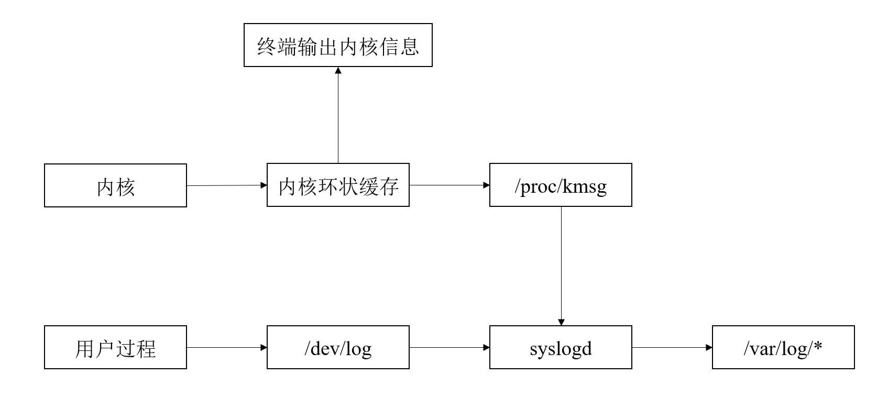

# Linux服务器程序规范
- 服务器一般要考虑一些细节问题，而且基本是模板式的，又称之为服务器程序规范：
- - Linux服务器程序一般以后台进程形式运行。后台进程又称为守护进程，它没有控制终端也不会意外收到用户输入。守护进程的父进程通常是init进程。(PID为1)
- - Linux服务器程序有一套日志系统，它至少能输出日志到文件，有些甚至能输出到专门的服务器。大部分后台进程都在/var/log目录下拥有自己的日志目录。
- - Linux服务器一般以一个专门的非root身份运行。
- - Linux服务器程序通常是可配置的，存放在/etc目录下。
- - Linux服务器进程通常会在启动时候生成一个pid文件并存入/var/run目录中，以记录该后台进程的PID。
- - Linux服务器程序通常需要考虑系统资源的限制。
## 日志
### Linux系统日志
Linux提供一个守护进程来处理系统日志——rsyslogd。
- rsyslogd守护进程技能接收用户输出的日志，又能接收内核的日志。用户进程通过调用syslog函数生成系统日志，该函数将日志输出到一个UNIX本地socket类型文件/dev/log中，rsylogd则监听该文件以获取用户的进程输出。
- 对于内核日志，内核日志由printk函数打印至内核的环状缓存中，环状缓存的内容直接映射到/proc/kmsg中，rsyslogd通过读取该文件获取内核日志。
- rsyslogd在收到用户进程或者内核输入的日志后，会把他们输出至某些特定的日志文件。日志信息如何分发可以再rsyslogd的配置文件中设置。

### syslog函数
- 应用程序syslog函数与rsyslogd守护进程通信，具体定义如下。
- 同时还可以通过openlog函数来设置syslog的默认输出方式，其中ident字符串将被添加到日志消息的日期和时间之后，它通常被认为是程序的名字。
- logopt是一些配置参数，facility参数可用来修改syslog函数中的默认值。
- setmask是用来过滤日志消息，对于小于maskpri等级的日志都直接过滤。
- 最后是关闭日志功能，closelog()。
```cpp
#include<syslog.h>
void syslog(int priority,const char* message,···);
void openlog(const char* ident, int logopt, int facility);
int setmask(int maskpri);
void closelog();
```
priority是所谓的设施级别与日志级别按位或。设施值默认LOG_USER，日志级别有：
```cpp
#include<syslog.h>
#define LOG_EMERG       0   //系统不可用
#define LOG_ALERT       1   //报警，需要立刻采取动作
#define LOG_CRIT        2   //非常严重的情况
#define LOG_ERR         3   //错误
#define LOG_WARNING     4   //警告
#define LOG_NOTICE      5   //通知
#define LOG_INFO        6   //信息
#define LOG_DEBUG       7   //调试
```
## 用户信息
用户信息对服务器的安全性来说是十分重要的，大部分服务器就必须以root身份启动，但不能以root身份运行。
- 一个进程一般拥有两个用户ID:UID和EUID。EUID即有效用户，其存在的目的是方便资源访问。
- 比如启动su程序需要访问/etc/passwd文件，但启动su是以普通用户的身份启动的，用户不具备访问这个文件的权限，它能访问就是因为su程序的有效用户是root。有效用户是root的进程又被叫做特权进程。当一个进程的所有者是root且被设置了set-user-id的标志，就说明进程的有效用户是root。
- 有效用户需要设置，一般默认的时候都是启动程序的用户。
## 进程间关系
Linux下每个进程都隶属于一个进程组，所以一个进程除了PID以外，还有PGID进程组的ID。

- 每个进程组都有一个首领进程，其PGID与PID相同，进程的PGID可以设置，一个进程只能设置自己或其他子进程的PGID，并且当子进程exec后，父进程不能设置其PGID。
- 一些有关联的进程将会形成一个会话（session）。创建会话不能由进程组的首领来发起，否则将会产生一个错误。
- 对于进程在后台运行，其实就是fork出一个子进程，然后把父进程关掉，子进程就在后台运行了，同时也叫作守护进程，但这样做不就是孤儿进程的做法，有些不太理解。
