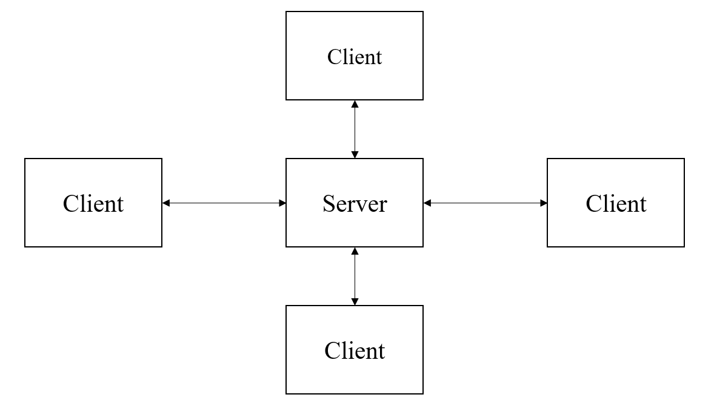
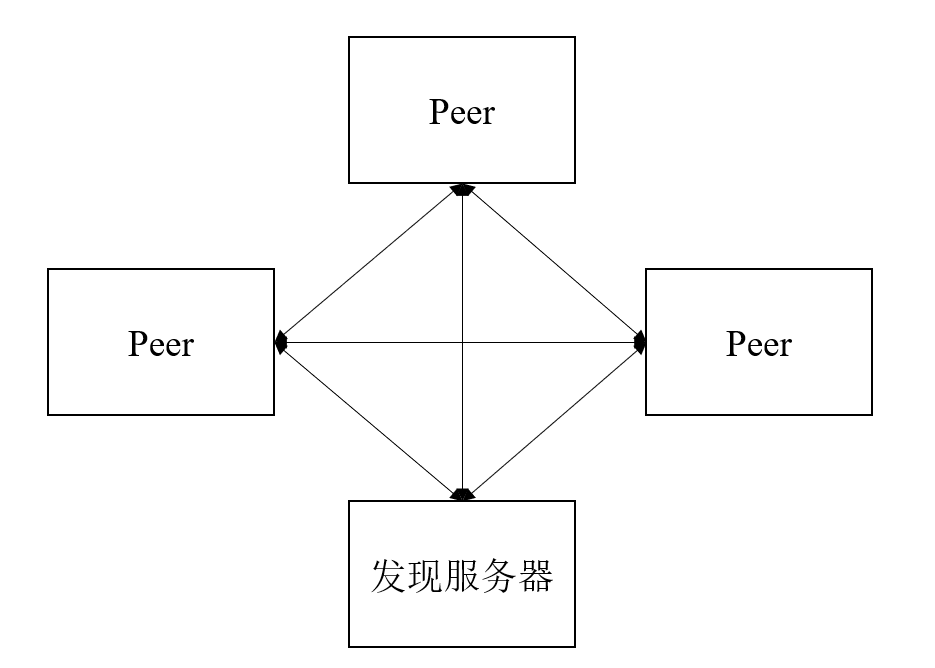
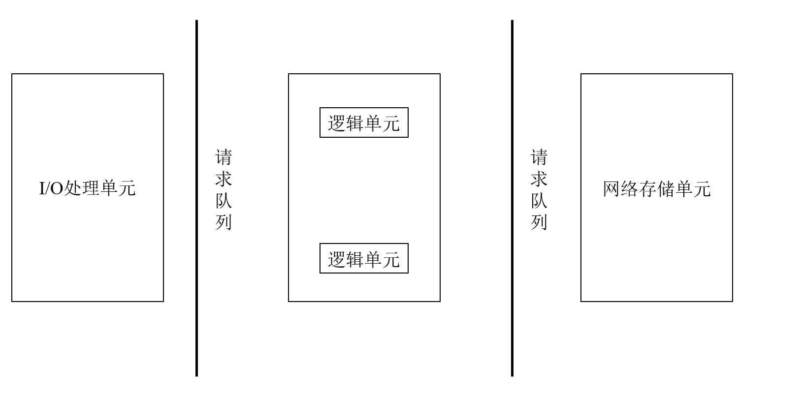
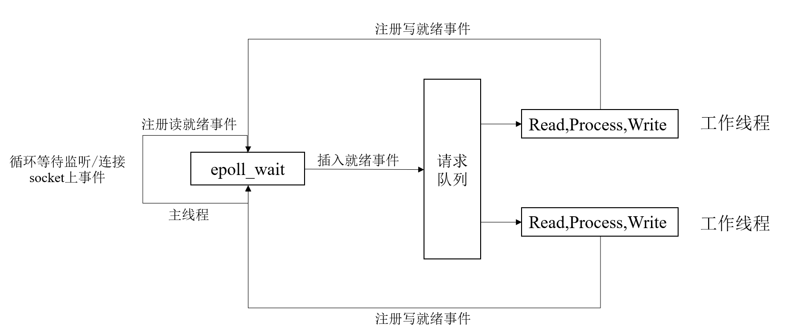
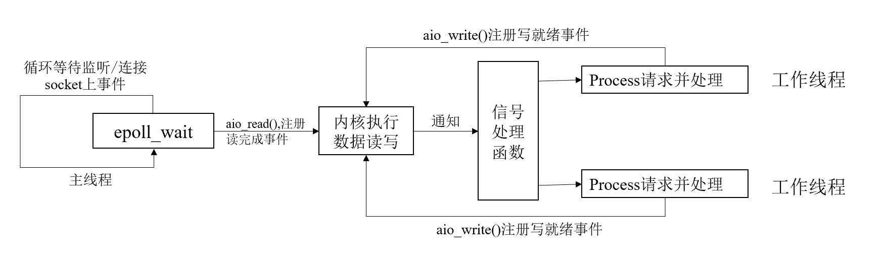
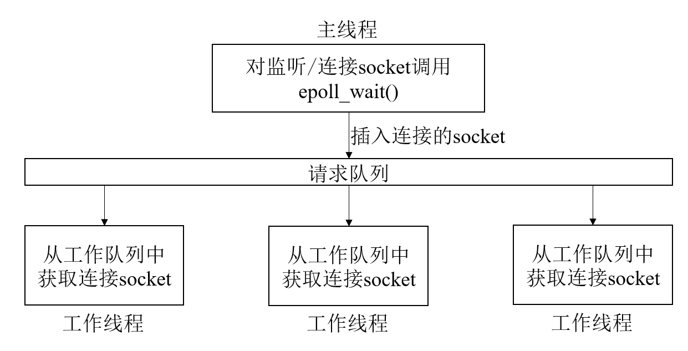

# 高性能服务器框架
## 服务模型
### C/S模型
- C/S模型即client/server模型。在互联网中，资源都被数据提供者所垄断，所有的client都通过访问server来获取所需资源。

- C/S模型的逻辑很简单，就是服务器启动后创建一个监听socket，并把它绑定到对应端口上，然后调用listen函数创建监听队列等待client连接。当监听到连接后，server调用accept函数接收它。并为其分配一个新的逻辑单元来处理它的请求。
- server端在处理一个客户请求时，还必须继续监听其他客户请求，否则就变成了效率低下的串行服务器了。
- CS模型非常适合资源相对集中的场合，但缺点也很明显，server的负载能力决定了整个系统的性能，当访问量过大时，所有用户可能都将得到很慢的响应。
### P2P模型
- P2P模型是指每个host在网络中的地位都是对等的，既能作为客户端，也能作为服务器。P2P模型使得每台机器在消耗服务的同时也给别人提供服务。P2P有个很严重的问题是主机之间很难相互发现，所以一般P2P有一个专门的发现服务器。

## 服务器编程框架

- 对于一台主机的服务端来说，I/O处理单元是服务器管理客户连接的模块，它负责受理client的连接，利用socket接口与客户端交互数据；而逻辑单元则是一个进程或者线程，它收到数据后具体的去处理每个客户端的业务；有时候这些业务需要保存到网络存储单元中或者需要从服务器的数据库中查询，这就需要网络存储单元；请求队列则是各模块间的通信方式的抽象。
- 对于大规模集群来说，I/O处理单元就是接入服务器，实现负载均衡；逻辑处理单元就是逻辑服务器，处理每一个业务的逻辑；网络存储单元就是数据库服务器，而请求队列就是各个服务器之间的接口与连接，是个单元之间通信方式的抽象。
  
## I/O模型
- 对于所有文件描述符来说，都有阻塞与非阻塞的概念。对阻塞的文件描述符进行读写，程序需要一直等待至事件发生并结束才会返回，对于非阻塞的则是触发函数立刻返回，如果事件没有发生，则返回-1。
- 一般来说，我们只有在事件发生时去操作I/O才能提高程序的效率。所以一般I/O会和其他I/O通知机制一起使用，比如I/O复用和SIGIO信号。
- I/O复用是最常用的I/O通知机制，应用层序通过I/O复用函数注册一组事件。内核通过I/O复用函数将其中就绪的事件通知给应用程序。Linux中常用的I/O复用模型是select，epoll等。I/O复用本身是阻塞的，他能提高效率的原因是它具备同时监听多个I/O事件的能力。
- SIGIO信号也可用来报告I/O事件。可以给目标文件描述符指定一个宿主进程，当文件描述符有事件发生时，宿主进程将收到SIGIO信号。
- 同步I/O模型是指，用户代码自行执行I/O操作，将数据从内核缓冲区读入用户缓冲区，将数据写入内核缓冲区。而异步I/O是指数据在用户空间和内核空间的移动在内核中完成。同步IO通知的是I/O就绪事件，而异步I/O通知的是I/O完成事件。因此上述的I/O复用，阻塞I/O，信号驱动I/O都是同步I/O模型。
## 两种高效的事件处理模式
- 服务器通常需要处理三种事件：I/O事件，信号事件，定时事件。对于这三种事件的处理，通用的有两种事件处理模式：Reactor，Proactor两种模式。一般来说，同步I/O模型适用于实现Reactor模式，异步I/O模型适用于实现Proactor模式。
### Reactor模式
- Reactor是要求主线程(I/O处理单元)只负责监听文件描述符上是否有事件发生，有的话就将该事件通知工作线程。除此外，主线程不负责任何实质性工作。**I/O读写，处理客户端请求均在工作线程中完成**。

其工作流程大概就是：
1. 主线程往epoll内核事件表中注册socket上的读就绪事件。
2. 主线程调用epoll_wait函数等待socket上有数据可读。
3. 当socket上有数据可读时，epoll_wait通知主线程，主线程则将socket可读事件放入请求队列。
4. 睡眠在请求队列上的某个工作线程被唤醒来处理客户请求，它往socket上写入服务器处理客户请求的结果。
### Proactor模式
- 与Ractor模式不同，**Proactor所有I/O操作都由内核来处理**，工作线程只负责处理业务逻辑，有些特殊情况下也有主线程来处理I/O的，但一般的模型是主线程向内核里注册读的事件，I/O读完再通过信号通知程序，由信号处理函数指定一个线程去处理，处理完写入时再向内核里注册写的事件。

Proactor模式具体的工作方式是：
1. 主线程用aio_read函数向内核注册socket上读完成事件，并告诉内核用户读缓冲区位置，以及读操作完成时应该如何通知应用程序。
2. 主线程继续处理其他逻辑。
3. 当socket上数据被读入用户缓冲区时，内核将向应用程序发送一个信号，通知应用程序数据可用。
4. 应用程序预先定义好的信号处理函数选择一个工作线程来处理客户请求。工作线程处理完客户请求后，调用aio_write函数向内核注册写就绪事件，并告诉内核用户写缓冲的位置，由内核负责用户缓冲区与内核程序的数据搬移。
### 两种并发模式
- 并发就是让程序同时执行多个任务，如果程序是计算密集型的，并发操作没什么优势，反倒因为不断切换导致程序效率降低；但如果程序是I/O密集型的，如经常读写文件，访问数据库等，则情况就大不相同了。此时并发可以不让程序等待I/O执行完而去切换做别的事情，提高了CPU的利用率。
- 并发模式是指I/O处理单元和多个逻辑单元之间协调完成任务的方法，主要侧重点是怎么实现多线程或多进程。这里的同步与异步与I/O的同步异步不同，在并发模式中，同步是指程序按代码顺序执行，异步是指程序需要事件来驱动执行(中断，信号等)。
- 按同步方式运行的线程叫做同步线程，按照异步方式执行的线程叫做异步线程，一般来说异步线程执行效率高，实时性强，很多嵌入式程序都会采用异步模式，但异步模式对于并发不是很友好，执行的程序相对复杂，难于调试和拓展。而同步线程虽然效率相对较低，实时性较差，但是其逻辑简单。
- 所以对于服务器这种需要执行效率高，又能同时处理多个连接的要求，人们提出了一种半同步，半异步的模式。即：同步线程用于处理客户逻辑，即逻辑单元；异步线程用于处理I/O事件。当异步线程监听到客户请求时，就将其封装成请求对象插入请求队列中。请求队列将通知某个工作在同步模式的工作线程读取并处理该请求对象。具体选择哪个工作线程来为新的客户对象服务，则取决于请求队列的设计。
- 考虑到两种事件处理方式以及几种I/O模型，则其存在多个变体，有一种被叫做半同步/半反应堆的设计。

- 异步线程只有一个，那就是主线程，主线程负责监听所有socket上的事件，如果监听socket上有新的连接到来，那么就往epoll内核事件表中注册该socket上的读写事件。如果连接的socket上有读写事件发生，那么主线程就将其封装成请求事件放入请求队列，由请求队列分发至工作线程上。
- 半同步半反应堆模式有如下几个缺点：
1. 主线程和工作线程共享请求队列，主线程往请求队列中添加任务，或者工作线程从请求队列中取出任务，都需要加锁。效率不高。
2. 每个工作线程只能处理一个客户请求，如果客户数量多，则请求队列会堆积很多事件，客户端的响应也就会越来越慢。
- 针对这些问题，也有人提出了另一种相对高效的模式，即主线程只专注于监听是否有新的socket连接，当监听到有连接后，将其分发给某个工作线程，该工作线程将socket注册到自己的epoll事件表中，处理该连接。这样就是多个epoll模型来独立的工作。主线程只负责派发socket。
## 提高服务器的其他建议
### 池：
- 如果服务器硬件资源充沛，那么就不需要动态分配资源，在服务器初始化之初就创建好，省去在运行中初始化资源的代价。当服务器运行时需要一个线程或者一块内存，可以直接从池中获取，无需不停的切换到内核态。
- 常见的池有内存池，进程池，线程池，连接池。内存池通常用于socket发送与接收缓存，进程池和线程池都是并发执行的方法，当我们需要一个工作进程或线程来处理用户请求，就可以直接从池中分配，而无需fork或pthread_create,连接池常用于处理服务器或服务器机群内部的永久连接。每个逻辑单元可能都需要频繁的访问本地一个数据库的时候，如果每次都要三次握手建立连接效率太低，一个解决方案是先建立好一组连接，每次从中取出一个，用完再放回去。
### 数据复制
- 高性能服务器应避免不必要的数据复制，如果数据能直接从内核中走，无需应用程序去处理，那么就应该直接从内核走。比如ftp服务器，当客户请求一个文件时，服务器只需要检测目标文件是否存在，不会关心其内容，这样就可以用零拷贝函数直接发给客户端。
- 此外，用户空间内部的数据复制也应该避免，当两个进程之间要传输大量数据时，我们应该考虑共享内存的方式而不是管道或者消息队列来传递。如之前在解析HTTP请求时，不用把行的内容复制到某个缓冲区而是直接用指针读写位置，提高了效率。
### 上下文切换和锁
- 并发必须考虑上下文切换带来的开销，即使是I/O密集型服务器，也不应该使用过多的工作线程(进程)来处理。
- 并发必须要考虑的另一个是共享资源的加锁保护，锁可以避免并发带来的问题，但是锁的效率低下，如果能不用锁，就应该避免用锁。 