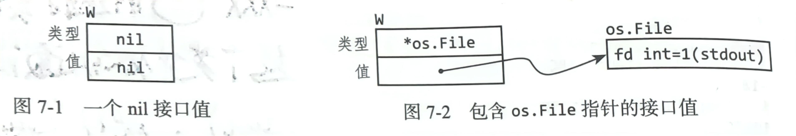

## 接口
### 接口即约定
- 接口是对其他类型行为的概括与抽象。和cpp来类比的话，就是一个抽象的基类。Go的接口无需声明它实现了哪些接口，只需提供接口所必须的方法就可。
- 接口是一种抽象类型，它仅仅提供一些方法，你知道的仅仅是它能做什么。它是定义了设计者与调用者的一些约定。
```go
type writer interface {
    Write(p []byte) (n int, err error)
}
```
### 接口类型
- 如果一个具体类型要实现该接口，那么必须实现接口类型定义的所有方法，接口也可以组合成新的接口。就是把接口嵌入到另一个接口中，另一个接口就获得了该接口的所有方法，就跟结构体嵌入是一个道理。
```go
type Reader interface {
    Read(p []byte) (n int, err error)
}
type Closer interface {
    Close() error
}
type ReadWriter interface {
    Reader
    Close
}
```
- 如果一个类型实现了一个接口要求的所有方法，那么这个类型就实现了这个接口。此时就可以把这个类型赋值给这个接口。接口会关注**是指针还是值实现了这个方法**，如果一个指针实现了该方法但你把值赋给该接口，此时就会报错。
```go
var w io.Writer
w = os.Stdout       //ok, os.File 有write方法
w = time.Second     //编译错误，缺少write方法
```
- 空接口可以被任何类型赋值。
- 接口提供的是抽象的功能，提供cpp中继承和多态的功能。
### 接口值
- 一个接口类型的值其实有两个部分：**一个具体的类型与一个值**。两者称为接口的动态类型与动态值。

- 接口值可比较，只要两个接口动态类型与动态值都相等，那么可以认为这两个接口值是相等的。这意味着接口值可以作为map的键。
- 注意避免将一个空指针(没有指向实际地址的指针)赋值给一个接口，空指针赋值意味着是有接口类型的，但具体里面的接口值是nil，所以如果传给一个接口后，这个接口因为有接口类型，所以不是nil，但是它没有接口值，一些防御性检查比如 != nil就会失效。
```go
func main() {
    var buf *bytes.Buffer
    const debug = true
    if debug {
        buf = new(bytes.Buffer)
    }
    f(buf)
}

func f(out io.Writer) {
    ...
    //注意这里，如果debug是false的话，会传一个空的*bytes.Buffer类型的指针，
    //这样这个接口的动态类型就是*bytes.Buffer,但值为nil，因为它有接口类型，所以它不是nil。
    //下面就会出错。
    if out != nil {
        out.Write([]byte("done!\n"))
    }
}
```
### 类型断言
- 类型断言是作用在一个接口值上的操作，x.(T), x是一个接口类型，T是一个动态类型，类型断言会检查x的动态类型是否和T一致，如果一致，返回的就是x的动态值，如果不一致，那么操作崩溃。
```go
if f, ok := w.(*os.File); ok {
    //使用f
}
```