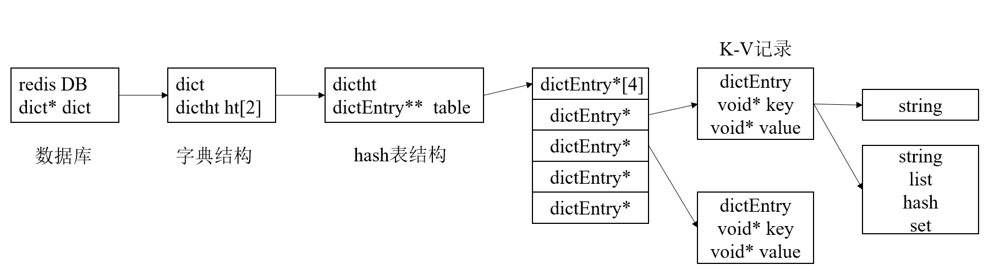
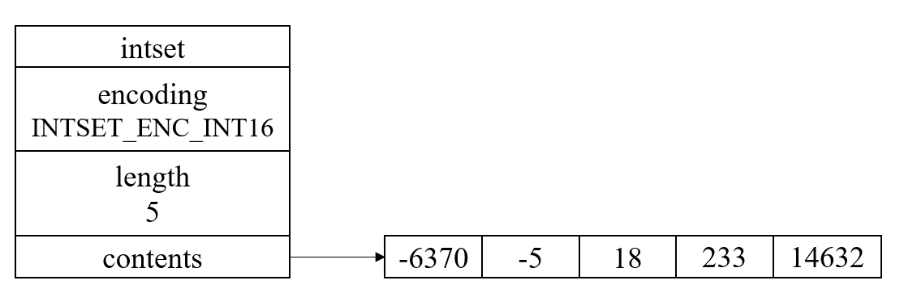
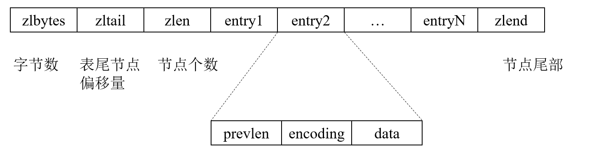
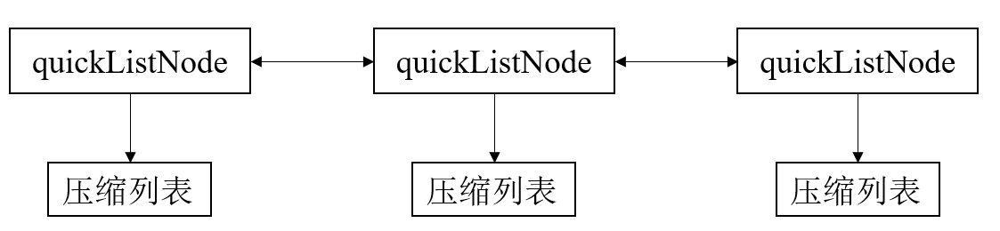

## redis中数据结构与对象
- Redis中，每个键值对都是由对象组成的，对象一般有5种，分别是字符串对象，列表对象，哈希对象，集合对象，有序集合对象。
- 而数据结构的话有9种，对象由数据结构来实现，比如字符串对象的底层实现是SDS。
### 简单动态字符串
- redis没有直接使用字符数组，因为直接使用字符数组太原始了，redis再上面加了一层抽象，现在是简单动态数组SDS。
- 众所周知，redis是以K-V的形式存储的，key与value一般来说，key就是一个SDS，如：
```
SET msg "hello world"
```
- 这句话就是表示设置了一条记录，key是msg，value是"hello world"。不仅仅是作为key和value，SDS还可以作为缓冲区存在，比如在AOF缓冲区做持久化的时候，就是通过SDS来保存的。
- SDS是这么定义的：
```cpp
struct sdshdr{
    int len;        //记录buf数组中已使用的字节数量
    int free;       //记录buf中未使用字节数量
    char buf[];
}
```
- 虽然SDS是抽象出来的结构体，但是他还保留了部分C语言字符串的惯例，比如以'\0'结尾，这样带来的好处是，SDS可以直接使用C字符串中的大部分函数。
- SDS与c字符串区别有4点：
- - 首先是**获取一个SDS len的长度复杂度为1**，它通过len这个属性记录了SDS的长度。如何更新这部分由SDS自动来完成，而char[]的话，是需要strlen()函数一直遍历到非0才行。
- - **杜绝缓冲区溢出**，这个是因为SDS可以动态的调整char数组，自动修改其大小。同时SDS的扩展不是你用多少我申请多少，pop掉我再释放的思路，这样频繁的申请和释放太浪费了，它采用预分配以及惰性释放的策略。就是有一个free的属性在，它表明了空闲的字符数量。对于小于1MB的，采用直接2倍扩容的思路，对于大于1MB的，直接2倍扩容有点浪费，所以每次只给1MB的扩容。
- - **二进制安全**，这个主要是说，因为c中char[]数组很多都是以'\0'来进行结尾，所以说字符串中其实不能有'\0'这种字符，所以对于二进制保存，不是很安全，但SDS中不是以'\0'来判断结尾的，他有个属性len，这个属性可以判断是否读到结尾了。
- - **兼容C函数**，虽然SDS是二进制安全，以len长度判断结尾，但是在buf中依然最后一位是'\0'，兼容了C字符串的特性。所以C中的函数部分也是可以直接用的。
### 链表
- 链表的好处是**高效的重排能力，以及其顺序的节点访问方式**，用法比较灵活，但随机访问的性能较差。列表对象的底层实现就是链表。
```cpp
struct listNode{
    listNode* prev;
    listNode* next;
    void* value;
}
struct list{
    listNode* head;                         //头
    listNode* tail;                         //尾
    unsigned long len;                      //长度
    void* (*dup)(void* ptr);                //复制节点函数
    void* (*free)(void* ptr);               //释放节点函数
    int (*match)(void* ptr,void* key);      //节点匹配函数
}
```
- redis中的链表是**双向链表**，有prev也有next；它**无环**，存在一个head和end节点，同时携带链表中节点长度的计数器，**获取节点长度的复杂度为O(1)**。**多态**，链表通过void*指针来保存节点的值并且它还携带着dup,free,match这三个函数指针。通过对不同的对象设置这三个函数，链表可以存储各类的值。

### 字典
- 字典是一种保存键值对的数据结构，K-V。字典中每个键都是独立的，通过键来检索值，其底层实现是一个hash表，并且redis中数据库也是通过这个字典这个数据结构来实现的，它的一个具体结构如下图：

- 一个数据库里会有一个字典结构dict；dict里面有2个hash表，ht[0]是主要负责存储的，ht[1]是负责rehash扩容时候才会使用的；hash表的记录用dictEntry来记录，dictht中存在一个table来保存多条记录；dictEntry中有一个key与一个value。都是void*，用保存不同的对象，一般key只能是string，value可以是5种对象中任何一种。
- **hash键冲突**的思路是开链法，就是dictEntry有一个next节点，它可以以链表的形式链上下一个节点。
- **rehash**的思路跟java中的hash表思路很像，采用渐进式hash扩容的思路：
- 首先扩容情况有两种：服务器没有执行BGSAVE时，此时要求装载因子大于1启动rehash；当服务器执行BGSAVE时，先不rehash，等待BGSAVE完成。如果装载因子大于5时，此时由于hash表超载严重，性能下降的比较厉害，所以无论是否在BGSAVE，此时都rehash。
- 接着是如何**扩容**，首先它会准备两个hash表，就是之前字典里的ht[0]与ht[1]。ht[0]是平常正在使用的，ht[1]是rehash时使用的，首先会把ht[1]开辟大于ht[0]二倍且是2幂次方的空间。这个就是新的hash表了，然后就是把ht[0]的数据搬移过去，但是如果数据量很大，直接搬移可能会在一瞬间数据库产生很高的负载，甚至数据库崩溃。所以这里采用渐进式的思路，用一个rehashidx记录已经搬移的数量，新纪录查到ht[1]中，每次访问旧记录时，从ht[0]中搬移到ht[1]中，然后rehashidx++，最后当所有旧的全搬移完了，也就是rehashidx等于ht[0]的大小，此时就释放掉ht[0]，然后让ht[0]指向ht[1]的数据。

### 跳表
- 跳表就是一个有序链表，然后链表中会存在多个指针，指针的数量是roll出来的，roll 0，1，然后roll到1就多一个指针。指针可以通过层来划分，上一层一般是下一层节点个数的1/2。将链表的高度与输入解耦，而时间复杂度只与链表高度有关，通过这样，跳表的性能与平衡树的性能基本一致，平均O(logn)。
- 跳表访问O(logn)的原因是，跳表访问的次数跟节点高度与每层节点下降所需经过的个数有关，一般节点高度为O(logn)，每层平均走三个节点，所以平均下来就是O(logn)
- 跳表在redis中主要是用来作为有序集合对象键的底层数据结构，以及在集群节点中作为内部数据结构。redis的跳表由zskiplist和zskiplistNode两个结构组成，zskiplist用于保存跳表的信息：表头节点，表尾结点，长度，最大的那个节点的层数等；而zskiplistNode用于表示其中一个节点，一个节点里有分值，即key，用于排序；成员对象，即value；层,每层有一个指针和节点跨度，多层用于加速搜索，节点跨度用于记录两个节点间的距离；后退指针用于从表尾向表头方向遍历节点，但由于后退指针只有一个，所以后退时候相当于普通的链表。
### 整数集合
- 整数集合是集合键的底层实现之一，其底层实现是一个有序的INT8类型的数组。虽然它保存数据时候是INT8,但数组真正的类型取决于encoding属性的值；比如encoding属性的值为INTSET_ENC_INT16，那么contents就是一个int16_t类型的数组。encoding的属性有3种，INT16,INT32,INT64。

- 上面这就是一个整数集合的表示，整数集合有一个很重要的操作，升级：每当新添加的元素类型超过了集合原本的类型大小时，集合就会触发升级操作。就比如原来是INT16,现在来了个超过INT16,是INT32位的数后，你需要将所有都升级成INT32。
- 升级的原因是，首先是提高了**灵活性**，集合可以存储大于它类型所限制的大小；然后是**节省了空间**，无需一开始就开很大的数组，需要时候再升级。
### 压缩列表
- 它是一种内存紧凑的数据结构，**方便利用CPU的缓存以及节约内存**。压缩列表可以用于列表键和hash键的底层数据结构。

- 压缩列表的好处在于紧凑连续的空间，较好利用cpu缓存，同时也节省空间，但它的问题在于，当新增或者重新修改时，压缩列表的占用空间可能会**重新分配**。
- 前一个节点的长度小于254字节，prevlen就是1byte，前一个节点长度大于254字节，prevlen就是5byte，5字节的原因是压缩列表会将第一个字节设置为0xFE，剩下4个字节来存储大于254字节的长度。
- 因此当一个节点扩大大小时，后序的节点存在重新分配的可能性，如果一直重新分配的话，可能会出现**连锁更新**的问题。
### quickList与listPack
- quickList是用双向链表+压缩链表来实现的，它用来解决压缩列表连锁更新的问题，它将分段的压缩列表用链表串起来，这样更新最多就只是连锁更新这一段压缩列表。

- listPack是另一种做法，它每个节点保存当前元素的长度而不是prevlen，我其实觉得奇怪就是为啥一定要prevlen，理论上prevlen是用来逆序遍历的，但是为啥要逆序遍历，这个操作我感觉重要性不大。