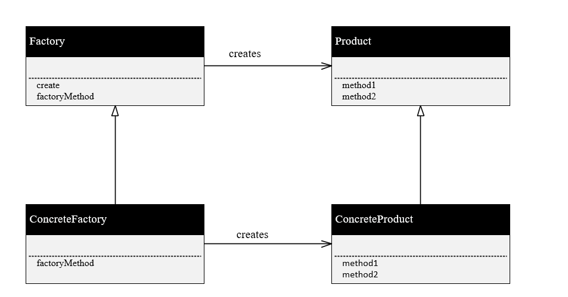

## Factory method模式
- Factory顾名思义，工厂，也就是用于构建实例的类，构建的是product类的实例。应该会提供一个create函数来返回一个product类的实例。
- 一般来说Factory都是一个抽象基类，只写了create函数，具体的create函数中调用的生成实例由派生类去实现。这里采用了Template Method的模式，主要是考虑工厂的逻辑可以通用化，但不同的工厂应有不同的生产实例。
- 可以说，抽象的Factory与Product是框架，而底下的派生类ConcreteFactory与ConcreteProduct是具体加工的东西。
