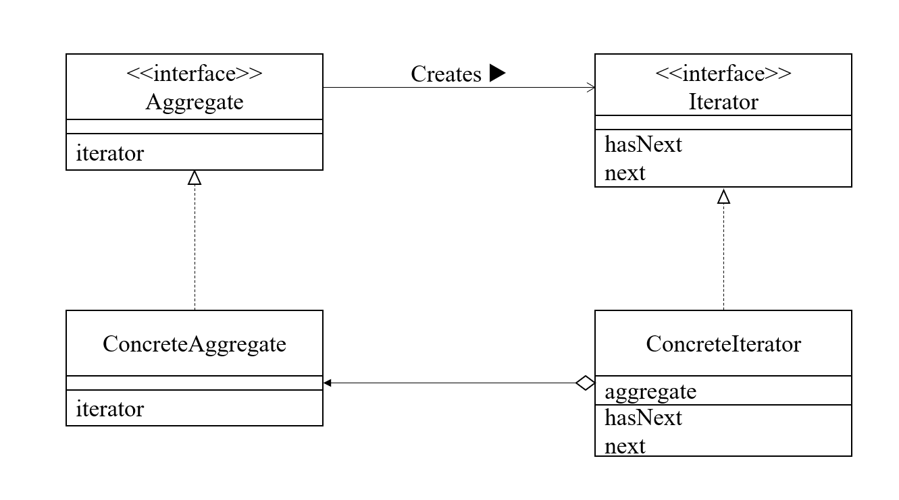

## Iterator模式
- 所谓Iterator其实用的已经很多了，最常见的就是STL里的迭代器，Iterator模式一般需要4个类，下面是它的类图：

- 它需要4个部分，两个抽象的基类Aggregate与Iterator,这两个的作用分别是抽象的集合与迭代器，集合用于存放元素，并且它可以返回一个iterator；由于不知道具体的元素是什么，所以这两个都是模板类。
- 他们两个派生出实际的存放对象的集合以及相应的迭代器，比如书架与书架的迭代器。
- 模板类的好处在于，可以让遍历集合的操作不依赖与集合的具体实现，只需要next一直往下走就行。