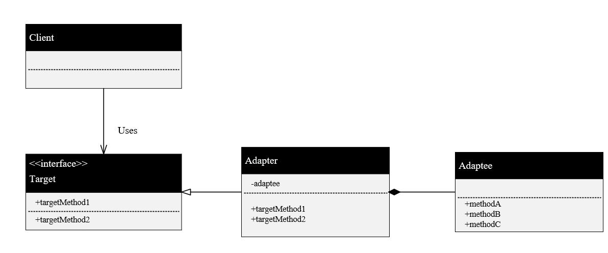

## Adapter模式
- adapter模式主要是用于已经存在一个功能比较完善的类，但跟需求不符，没有办法直接使用，需要做一些微调，这时候可以在外面加一层适配器。
- 最典型的例子就是STL里，基于deque的适配器比如stack，queue。deque是一个双端开口的分段连续的容器，但对于stack来说，其定义只能单端开口，因此可以在其基础上做一些封装；再比如说queue是个队列，只能一边进，一边出，因此这里应该封掉一边的进，封掉一边的出，deque就变成了queue。
- 从Adapter模式的角色来说，他需要Target，Client，Adapter，Adaptee这4个角色：
Target就是你的需求，你需要生成client对象来干活，但client实际上只是一个接口，它具体的功能实现是在其派生类Adapter中实现。Adapter就是适配器，它里面复合了一个adaptee的对象，adaptee就是别人已经写好的类，在Adapter中封装一下就可以满足target的需求。
- Adapter模式主要是对已有的类进行适配，生成新的类，**不需要修改现有代码的前提下适配新的接口**。这样子做的好处在于，别人完整的代码不需要修改，因为修改意味着会产生新的bug，需要重新的测试，工作量很大。
- Adpater模式还有一个好处就是，版本升级与维护很方便，对于支持旧版本的程序兼容新版本的问题，可以做一个**新版本到旧版本的适配器**就可以实现兼容。
- 
