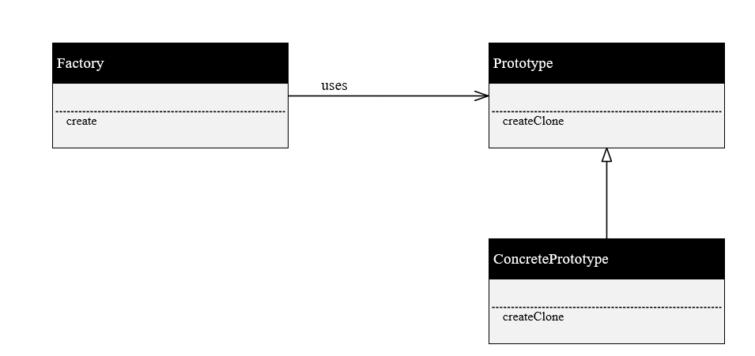

## prototype模式
- prototype模式就是原型模式，也就是提供一个复制的函数，可以通过该函数来复制一个跟原对象一模一样的实例。在cpp中，原型复制比较简单，直接调用相应的拷贝构造参数并传入相应自己的实例即可，即*this。一般来说原型模式可以跟工厂模式搭配，提供一个工厂来create相应复制的原型，用一个hash表来存储相应的原型。每次根据输入的key值来复制原型。

上面这个就是个factory method模式与原型模式的混合体。