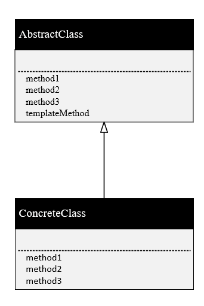

## Template Method 模式
- Template Method就是指在**父类中定义处理流程的框架，在子类中实现具体的处理**。
- 这个Template Method与cpp中的模板不是一回事，这里的模板是指在基类中实现了一个函数，但该函数调用的是抽象的纯虚函数，具体该函数的实现是在派生类中去完成的。

- 像一般AbstractClass中的templateMethod是需求的功能，它在基类中通过了三个method实现，但是3个method是纯虚函数，其实现都是在其派生类中实现的。
- 这种template模式的好处在于：
1.可以使**逻辑通用化**，逻辑已经在基类中被定义好了，而派生类只需要补充具体实现即可。如果基类的逻辑出现问题，那么也只需要改动基类，无需修改其具体实现的派生类。