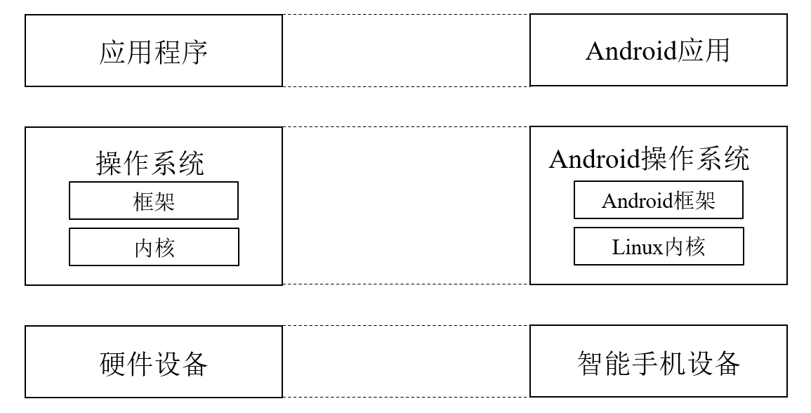

## 操作系统概述
### 什么是操作系统
- 操作系统是 “统一管理和调度计算机硬件中的各类资源、为各类应用程序和系统软件提供服务” 的软件。操作系统有两个职责，对硬件进行管理与抽象，为应用提供服务并进行管理。也就是说：它定义并管理一组由硬件与软件抽象的对象，并为对象提供了一组API。
- 从硬件的角度来看，操作系统主要是管理硬件，并对硬件进行抽象。一方面，操作系统将复杂的，具备不同功能的硬件资源纳入统一管理；**另一方面，操作系统将有限的、离散的资源抽象为无限的连续的资源，这部分工作就是操作系统中很重要的一个主题——虚拟化**。
- 从应用的角度来看，操作系统主要包括两个功能，一个是服务应用，即给应用提供一组API，另一方面是管理应用，包括应用的加载、调度启动、切换、调度、销毁等。
- 下图左边是操作系统的基本框架；右边是Android操作系统的具体类比。考虑到现在操作系统的功能越来越丰富，现在操作系统也对其做了两层抽象，分别是操作系统内核与操作系统框架。操作系统内核主要是对硬件资源的管理与抽象，操作系统框架是基于内核提供的服务为不同的应用程序提供API与环境。

## 操作系统的必要性
- 如果没有操作系统，那么意味着应用需要直接与硬件打交道，直接实现对硬件资源的管理与抽象的功能。如果应用程序故障，那么可能会引起计算机的崩溃。
- 即使应用想直接操作硬件，但应用的启动与销毁，多个应用之间的协同也需要操作系统来完成。此外，操作系统也可以从全局的角度更合理的对应用进行调度，更高效的利用硬件的资源。
## 操作系统的接口
- 从应用程序的角度来看，操作系统提供了一系列的API，主要包括系统调用接口，POSIX接口，领域应用接口等。
- 系统调用接口是操作系统内核提供的一组API。
- 由于各个操作系统提供的系统调用均不相同，为了同一个应用程序在不同操作系统上的可移植性，逐渐形成了通用的接口标准，如POSIX接口。
- 在操作系统或POSIX提供的系统调用基础上，还可以面对不同的领域封装不同的领域应用接口。如面向汽车领域，一些车企联合起来提出了AUTOSAR的接口们以便于汽车电子平台各部件的开发者遵循同一个标准和软件架构开发。
