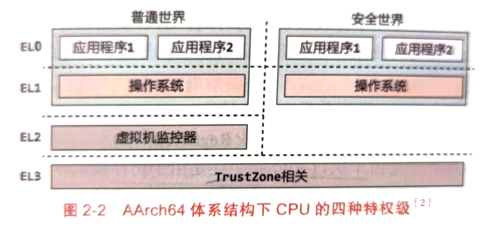
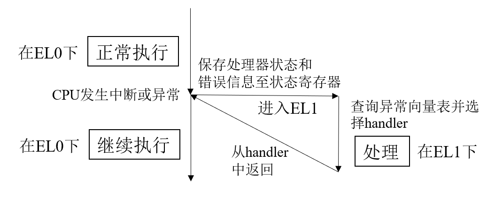
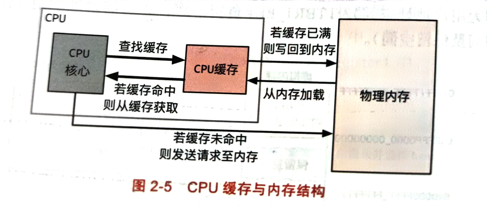
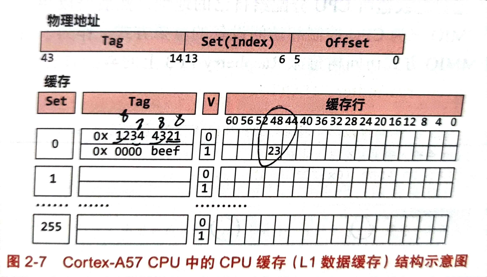

## 硬件结构
- 当今的计算机基本都是冯诺依曼架构，冯诺依曼架构主要包含三个体系，中央处理单元(CPU)，存储器(Memory unit)，输入与输出(I/O)。
- 中央处理单元：负责运算与逻辑控制，按照程序中的指令进行计算，并根据条件执行程序中的不同部分(顺序或跳转执行)。
- 存储器：负责存储程序指令与数据，以及保存程序执行的中间结果与最终结果。
- 输入与输出：负责与外界进行交互，从外界获取输入，将结果向外界输出等。

### CPU与指令集架构
- 指令集架构(ISA)是CPU与软件之间的桥梁。ISA包含指令集、特权级、寄存器等诸多方面：
#### 指令集
- 指令集本质上就是汇编代码，指令集一般分为精简指令集计算机(RISC)与复杂指令集计算机(CISC)两种。比如arm处理器中AArch64体系架构就属于精简指令集计算机，而x86-64体系架构属于复杂指令集计算机。
#### 特权级
- 特权级即用户的权限，是ISA的重要组成部分，AArch64的特权级也被称为异常级别，一般共有4种特权级：
- - EL0:最低的特权级，用户程序运行在该特权级，也就是用户态。
- - EL1:操作系统通常运行在该特权级，也就是内核态
- - EL2:虚拟化场景下需要，虚拟机监控器常运行在该特权级。
- - EL3:和TrustZone安全特性有关，负责普通世界到安全世界的切换。

注:安全特性将整个系统分为普通世界与安全世界，计算机资源可以划分到两个世界中，安全世界可以不受限制地访问所有的计算资源，而普通世界不能访问被划分到安全世界的计算资源。
- 特权级一般切换发生次数的比较多的是EL0与EL1，也就是用户态和内核态的互相切换。用户态到内核态的互相切换主要有3种可能：
- - 用户程序自己调用系统调用时，此时应用程序会执行特权调用svc。
- - 应用程序执行了一条指令但这条指令触发了异常，那么此时也会切换到内核态进行处理。
- - 应用程序在执行过程中，CPU收到了一个中断，这种切换不是应用程序的指令导致的，属于异步的切换。
- 切换的时候会先保存处理器状态与错误信息至状态寄存器，主要保存4个东西，异常触发的指令地址PC,异常的原因，当前CPU的栈指针SP。当发生特权级切换时，CPU会先获取异常向量表，然后根据异常的原因来调用相应的异常处理函数。异常处理完成后，会恢复应用储蓄的现场，恢复PC与SP指针，并切换到EL0。

#### 寄存器
- 寄存器是ISA的另一个重要组成部分，寄存器即CPU内部的暂存模块，它可以用来存储数据，指令，地址，还可以用来设置一些状态。如EL1特权级下有两个页表基地址寄存器TTBR0_EL0和TTBR0_EL1，负责翻译虚拟地址空间不同的地址段。负责翻译的范围由翻译控制寄存器来决定。
### 物理内存与CPU缓存
- CPU使用物理内存的方式很简单，就是通过**总线**向物理内存发送一个写入请求，其中包括目标地址，物理内存在收到请求后进行读写操作。所以对于CPU来说，物理内存其实就像一个数组，物理地址就是数组的下标。
- 相比于CPU的处理速度，内存访问的速度是相当慢的，为了降低开销，CPU通常引入了缓存，用于存放一部分物理内存的数据。访问缓存最快只用几个时钟周期，很快。

- 对于CPU写入，它会先写入缓存中；对于CPU读取，它会先尝试从缓存中查找，若未命中再到内存中读取，并保存在缓存中，以便加快下一次访问的速度。
#### 缓存结构
- CPU缓存是由若干个缓存行所组成的。每个缓存行额外包括一个有效位V，一个标记地址TAG。通常CPU以缓存行为单位将输入读入缓存中，也就是说即使单个字节的值，也会将其对应的缓存行读入缓存中，一般一行的大小是64B。
- CPU的缓存结构一般分为组(set)与路(way)两个概念。这个概念就需要直到物理地址是怎么映射到CPU缓存上的，CPU将物理地址逻辑上的分成Tag,Index,Offset 3段，这三段跟物理地址无关，是CPU自己分的，一般set段的位数是8，也就是说缓存行的最大容量是2^8=256。同一组，即set段相同的情况下，缓存最多支持4个不同的TAG，也就是4路。

如图是缓存的存储的一个具体例子：

### 设备与中断
这部分主要说CPU与外部设备之间交互的方式：
#### 内存映射输入输出
- 内存映射输入输出(MMIO)是一种常见的CPU控制与访问设备的方式，即将输入输出设备与物理地址放到一个空间，给输入输出设备也分配相应的地址，这样CPU就可以像操作内存一样操作相应的输入输出设备。
#### 轮询与中断
- CPU可以通过访问MMIO配置的地址来获取输入，但CPU如何才能知道有事件发生了？一种可行的做法是轮询，CPU不断去查看MMIO配置的地址，看看有无输入，但这样需要一直去访问，浪费时间。另一种相对高效的方式是异步通知，也就是通过中断来打断CPU当前的执行，使CPU不得不处理处理相应的读写事件。中断通知适合用于事件量很大而且是部分活跃的情况。因为单次轮询的代价肯定比单次中断要小，那么如果所有事件都很活跃或者事件数量很小，此时轮询的效率不一定低于中断，只不过这种情况一般很难遇到。