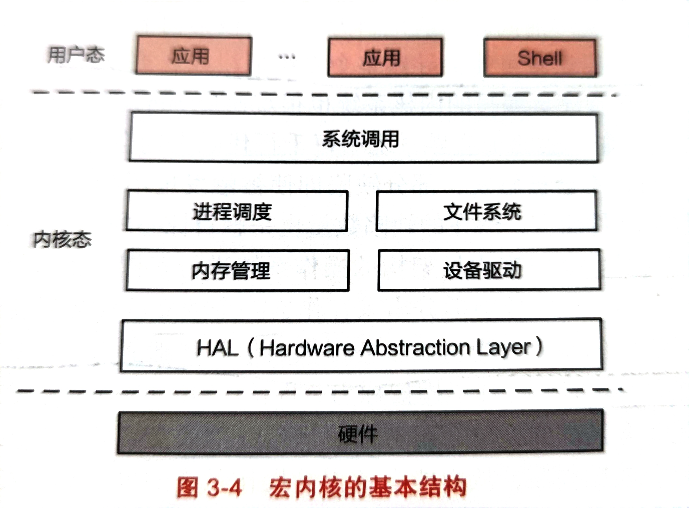

## 操作系统结构
- 在构建复杂系统时，必须合理考虑其内部结构，在不同需求间权衡。控制操作系统复杂度时，一个重要的设计原则是机制与策略分离：策略告诉系统做什么，机制告诉操作系统怎么做。通过机制与策略的分离，操作系统在面对不同的任务需求时可以选择不同的策略来实现不同的机制，不需再去为每一个机制专门的重构。
### 操作系统复杂度管理方法
复杂系统的管理方法主要是：M.A.L.H，即模块化，抽象，分层与层级。
- 模块化是一种分而治之的策原则；将一个复杂系统分解为一系列通过明确定义的接口进行交互的模块，将一个大系统分解为一系列易实现的小系统。划分时要注意不要划分过多的模块。划分时要充分考虑高内聚和低耦合，使模块具备独立性。
- 抽象是在具体划分模块的基础上，将接口与内部实现分离，在模块外只需关注接口，在模块内只用去实现接口。注意不要过度的抽象，过度的抽象必然会损失系统性能。抽象应该遵循**宽进严出**的原则，一个模块的接口应该容忍各种可能的输入，抑制各种恶意的输入与错误，并且尽可能严格控制模块对外的输出，减少对外输出的错误。
- 模块化与抽象可以将大系统分解成一堆小的模块，可是当模块数量很多时，模块与模块之间的交互会变得混乱，为了降低交互的复杂度，系统应进一步采取分层与分级的思想。
- 分层是指将模块按照一定原则进行层次的划分，将实现不同功能的模块划分成多个层次，相同层次的模块只能与内部和上下一层进行通信，而层级更多是在一层中进一步自上而下的明确各模块的功能，如一个公司有总经理，总经理下面有各个部门，各个部分内部还有分工。
### 操作系统的内核架构
#### 简要架构
- 简要架构就是将应用程序与操作系统放置在同一个地址空间中，无需底层硬件提供复杂的内存管理，特权级隔离等功能。该结构的优点在于应用程序对操作系统服务的调用可以高效的完成；但缺点同样明显，一旦应用程序崩溃，整个系统也会崩溃。
#### 宏内核架构
- 宏内核又称为单内核，操作系统的所有模块（进程调度，内存管理，文件系统，设备驱动）都会工作在内核态，直接操作硬件系统。由于系统内核的功能日益复杂，宏内核也采用MALH的复杂度降低策略。

- 宏内核的问题是，一个通用的，适用于大部分场景的系统设计很难满足特定场景下的如低延时等要求，同时，当内核越来越庞大，进行创新也就越来越困难，牵一发而动全身。而且因为在宏内核架构下，所有内核模块均被运行在等权空间，一个单点的错误就会导致系统崩溃或者被攻破。
### 微内核架构
- 随着宏内核的弊端日渐突出，人们又提出了一种完全相反的思路，微内核的概念。微内核就是只在操作系统内核中保留必须要保留的模块，如模块间消息通信，进程调度等，其余模块全部作为独立的服务被放入用户态。
- 在微内核的环境下，服务与服务之间是完全隔离的，即使一些模块崩溃了也不会导致整个操作系统崩溃。因此微内核架构下的可靠性与稳定性要强于宏内核。且因为微内核的架构将机制与策略进一步分离，可以更方便的为不同场景定制不同的服务来适应不同的要求。
- 微内核的问题在于设计者往往会过度抽象各个模块，导致一定系统性能损失，同时微内核的IPC性能与内核的资源占用很大程度上决定了操作系统的性能。
- L4微内核最小化原则：一个操作系统内核的性能只有在其放入内核态以外会影响整个系统功能时，才能被放置在内核态。
- 宏内核VS微内核
- - 弹性拓展能力，对于一个宏内核来说，很难仅仅通过简单的裁剪或拓展，使其支持资源诉求从KB到TB的场景。不是很理解。
- - 硬件异构性：异构硬件往往需要一些定制化的方式，对于宏内核来说，因为对内核修改起来比较麻烦，很难得到长期的支持。
- - 安全与稳定：因为宏内核的模块崩溃会导致整个系统崩溃，而微内核由于相应的模块以服务的形式加载到用户态，不会导致整个系统崩溃。同时因为各个模块之间隔离，所以恶意攻击很难通过一个模块影响到其他模块。
- - 确定性时延：微内核由于其各个服务隔离，其通信全靠操作系统的IPC机制，所以从IPC上即可控制整个操作系统的时延。相比于宏内核其时延抖动更小。
### 外核架构
- 操作系统在硬件管理方面主要的功能是硬件虚拟化与抽象。
- 硬件虚拟化主要存在2个方面的问题，其一是过度的硬件资源抽象会带来较大的性能损失；其二是操作系统所提供的硬件抽象主要是针对所有应用的通用抽象，这些抽象在一些特定的场景下不是最优选择。
- 最了解需要硬件资源如何抽象的是应用程序自己，因此外核就是将计算机的硬件资源切片，每个应用程序可以直接获得一块硬件资源，让应用程序来管理硬件资源。这与虚拟机与容器的思路一致。
- 外核的优点在于可以按照应用程序的特点与需求，动态的管理硬件资源，从而获得更高的性能；同时应用程序与应用程序之间互不干扰，完全隔离，所以安全性与可靠性高。
- 外核的缺点在于通常其为某个应用定制，缺乏跨场景的通用性，应用生态差。