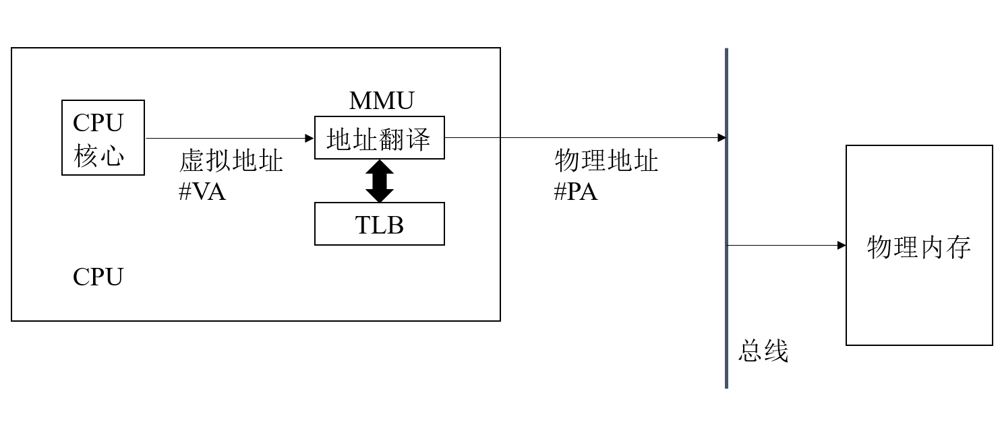
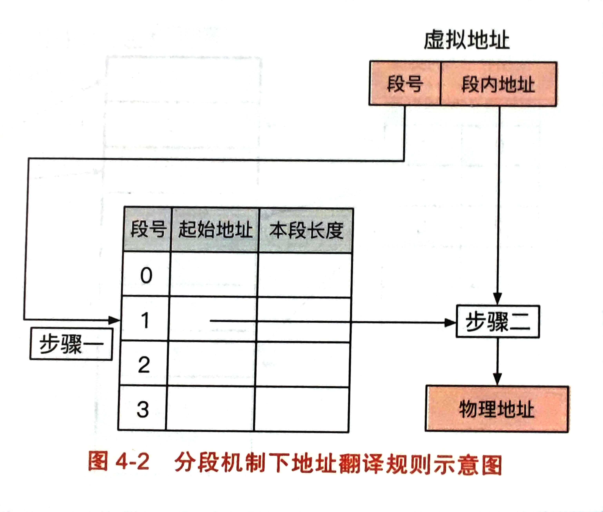
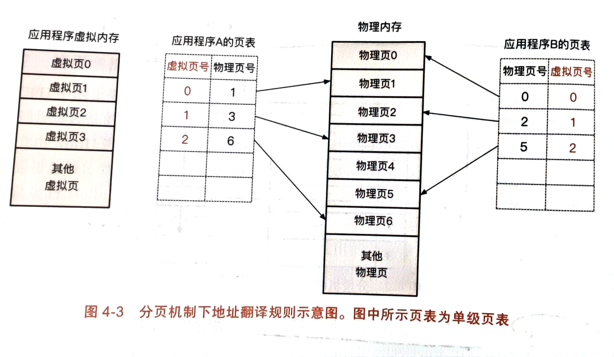
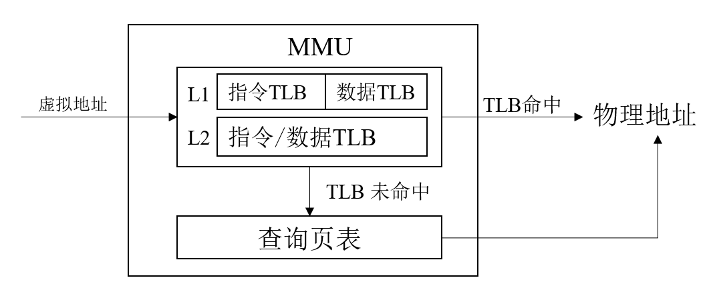

## 内存管理
内存管理主要是在说一件事：当多个应用程序同时运行时，操作如何让他们共同使用物理资源呢？
- 现代操作系统的一个普遍的做法是在应用程序与物理内存之间加了一层抽象：**虚拟内存**。应用程序是面对的是虚拟地址而不是物理地址，CPU负责将虚拟地址翻译成物理地址，操作系统负责虚拟地址到物理地址的映射。
- 虚拟内存的主要作用是让每个应用程序的内存地址连续统一，且相互隔离具备较好的安全性。
- 虚拟地址主要有三个目标：
- - 高效性：虚拟内存抽象不能占用太多的系统资源，包括CPU上的开销与物理内存使用。
- - 安全性：虚拟内存抽象要不同应用程序内存互相隔离，即一个应用程序只能访问属于自己的物理内存区域。
- - 透明性：要让编程者不用考虑虚拟内存与物理内存的差异。
### 虚拟地址与物理地址
- 把物理内存看做是一个大数组，每一个字节都可以通过与之对应的地址进行访问，这个地址就是物理地址。引入虚拟地址后，CPU访问地址的方法就是如下这张图：
 
- CPU在使用虚拟地址的时候，首先会通过内存管理单元MMU来将虚拟地址翻译成物理地址，具体翻译的流程是，首先先查看转址旁路缓存中有无缓存好的虚拟地址对应的物理地址，如果有直接使用；如果没有再向该程序页表中进行查询得到具体的物理地址。
#### 分段机制
- 虚拟内存到物理内存的方式主要有两种，分段机制与分页机制。
- 分段机制下：操作系统以段的形式管理/分配物理内存，当虚拟地址访问某个段的时候，MMU会查询段表得到对应的物理内存区域。在这种形式下，虚拟地址被分为两个部分：第一部分是段号，第二部分是段内偏移；每个应用程序都会存在一个段表，段表中存储，虚拟地址空间中每一个分段的信息，包括段的起始地址与段长。

- 分段的问题在于段与段之间易留下外部碎片，导致物理内存利用率下降，因此在分段的基础上又提出了分页机制。
#### 分页机制
- 分页机制相比于分段机制，将应用程序虚拟地址划分为连续等长的虚拟页，物理地址同样也这么划分。虚拟页与物理页长度相同，方便操作系统为每一个应用程序构造页表。该机制下，虚拟内存由两个部分组成，虚拟页号与页内偏移量。分页机制的好处在于每次分配的内存都是固定的，这样不会留下空白内存不够分配的情况，同时为了降低内部碎片的存在，应该让每个页尽量的小，一般的页大小是4KB。

- 注意：因为页的大小是固定的，所以页表中只有虚拟页号与相应的物理页号。而段表由于每个段长度不恒定，所以需要保存本段长度。
- 分页机制可以解决外部内存碎片的原因是分页的内存空间在虚拟页上是连续即可，而物理页上是可以离散分配的，只要映射好。
#### 基于分页的虚拟内存
- 页表是分页机制的关键部分，负责记录虚拟页到物理页的映射关系。但是因为页分的一般比较小，所以如果将全部虚拟内存空间建立页表映射不现实，以64位机为例：64位的地址可以表示2^64字节内存，一项页表主要存储物理地址，是8字节，那么总共需要2^64/4KB*8B大小的空间，这根本不可能。
- 这样表示的问题在于将所有内存地址都映射了，其实程序根本用不上这么大的空间。应该是用多少映射多少，但是单级页表问题在于其是按照数组索引的方式索引的，所以必须给所有地址都留下。这样必须想别的方法，比如说多级页表思路。
#### 4级页表
- 对于如何离散的存储一个物理页地址，并且可以快速的访问到，其实可以联想到字典树。4级页表其实就是这么个做法。一般来说一页大小是4KB，也就是2的12次方，所以虚拟地址的前12位是在页表中的偏移量。整个页表的起始地址存在页表基地址寄存器中，对于第0级来说，只存在一个页表页，其余每级页表有若干个离散的页表页。每个页表页是4KB，4KB/8=512条页表项，也就是2的9次方，所以第0级占9位，后面1，2，3级也都是各站9位。所以实际虚拟地址用来虚拟页表到物理页表映射的就是前48位。

- 当MMU翻译虚拟地址时，首先根据页表基地址寄存器找到第0级页表页，然后根据虚拟地址上的虚拟页号0寻找下一级页表的位置，找到下一级后再根据虚拟页号1找下一级的位置，最后找到第三级页表中的位置就是相应的该页物理地址。然后再通过虚拟地址中的页内偏移量找到具体的位置。
- 因为字典树的思路，没有我就不分配，所以相比于之前的1级页表要大大节省空间。
#### 加速翻译的TLB
多级页表可以显著压缩页表的大小，但是地址翻译的时长会增加。为了减少翻译的次数，MMU引入了TLB(转址旁路缓存)来加速翻译，TLB实际是在硬件上缓存的虚拟页号到物理页号的关系，可以认为其为hash表：key是虚拟页号，value是物理页号。翻译的时候首先先看TLB中有无缓存，若命中了直接使用；若未命中则再从页表中查询。

- 一般来说硬件页表的缓存条数有限，一个CPU上只有1000条，因此需要有效加以利用，一般TLB的翻译过程是用硬件来管理的；也有一些架构使用了软件管理，可以修改缓存策略，但是软件会使逻辑较为复杂。因为应用程序访问的内存具有局部性，一个被访问过的位置未来会多次访问，所以TLB一般命中的次数还是比较高的。
- TLB需要与当前页表的内容相一致，每个程序都有一个页表，所以在切换程序即切换页表时，TLB必须要刷新。一般应用程序与系统调用使用不同的页表，在X86体系中，操作系统会把自己映射到应用程序页表的高地址部分，因此一般发生系统调用不需要切换页表。
- 但如果应用程序切换频繁的刷新TLB，会发生大量的TLB未命中。因此操作系统引入了标签(PCID)的思路，给每个应用程序的TLB记录打上不同的标签，这样当切换TLB时，只用刷新指定标签的TLB即可。
#### 换页与缺页异常
- 对于虚拟页被分配但并没有相应的物理页映射时，此时就是缺页异常，不是所有虚拟页被分配了就一定会存在对应的物理页。
- 操作系统存在一个换页的机制，主要面对两个场景，1是应用程序的内存过大已经超出了系统实际的物理内存时；2是当程序不知道使用内存的大小预先申请了足够多的内存时。第一种情况就是当程序内存不够用时，为了能让程序正常工作，就把原来的一些不用的页换出去，换到物理硬盘里，需要用的时候再加载回来。第二种情况完全不知道它用不用的上，直接分配这么多内存浪费资源，所以也不提前分配物理页。
- 应用程序访问到未分配物理页的虚拟页时，此时就会报缺页异常，这时操作系统需要重新将存储到物理硬盘上的数据加载回物理页上。这个过程叫做换入；当操作系统将物理页从内存上移动到硬盘上，同时移除相应虚拟页的映射，这个过程叫换入。
- 由于换页过程中涉及耗时的磁盘操作，因此操作系统往往引入**预取**的机制来优化，就是在发生换页时，提前预测会有哪些页会被使用，然后提前将它们换入。
- 对于应用程序预先申请了很多大内存但未使用他们的情况，操作系统引入**按需页分配**来优化这个场景，即操作系统将新分配的虚拟页标记为已分配但未映射至物理内存。这样当应用程序访问这个虚拟页时，会发生缺页异常，这时操作系统才会为其分配物理页。按需分配能减少不必要的内存浪费，但是应用程序的访问延迟也会增加。所以要综合考虑。
- 最后是应用程序如何确定其选择的页，到底是未分配还是已分配但未映射的。应用程序的地址空间往往被划分成多个区域，如栈区、堆区、全局变量区、代码区等。只要访问的虚拟内存属于这些内存区域，那么就是已分配未映射的，如果不在这里面就是未分配的。
### 页的替换策略
- 当物理内存不够时，操作系统会换出一些暂时限制的页，换入急需使用的页，这个机制叫换页，换页就需要相应的策略。下面有些经典页替换策略：
#### MIN/OPT策略
- 这个策略是最优策略，操作系统可以预先知道未来物理页的使用情况，在选出被换出的页时，优先选择未来不会被访问的页。但是一般来说我是不知道未来要使用哪些页的，所以这只是一个评价标准，实际不会使用。
#### FIFO策略
- 这个策略是假设最先换入的页使用的概率最小，所以最先换入的页最先换出。操作系统维护一个队列来记录实际的物理页号。但实际上页的使用频率与进入顺序没什么关联，所以现代操作系统不怎么用。
#### Second Chance策略
- Second Chance策略是之前FIFO策略的改进版本，给每个物理页号维护一个标志，当物理页加入队列时，首先将其附上这个记号，如果换出时发现当前物理页有记号，那么记号清零移动到队尾。先移出没有记号的。
- 上述两个策略存在一个belady异常，是因为这种先进先出的思想并没有考虑实际页的使用频率，因此多存储的页不一定就是经常访问的。所以有可能加大了分配物理页的数量性能反而下降。现代操作系统换页策略应该考虑页的使用频率而不是先进先出。
#### LRU策略
- LRU策略是根据页的使用频率来确定换出那个页，它假设的是最近访问过的页很有可能再次被访问，它维护一个链表，新来的页先被放到页表尾部，一旦链表里的页被访问过了，就把它们拿出来重新放到尾部。
#### MRU策略
- MRU策略跟LRU策略相反，它假定最近访问过的页不会被再次访问，如视频流这种情况，看过的视频一般不会再看。但其实用的比较少。
### 虚拟内存的其他功能
虚拟内存能让应用程序独享一个独立而连续的地址的地址空间。除此之外还有很多其他的功能：

- **共享内存**：只要让两个程序的一个虚拟页同时指向相同的物理页，那么两个程序就能共享一个相同的物理内存。基于共享内存的思想，操作系统引入了写时拷贝，内存去重等功能。
- **写时拷贝**：写时拷贝主要是说如果两个程序加载了相同的物理资源，如同一个动态链接库，那么两个程序不同的虚拟页可以映射到一块物理页上，这样就可以显著的节省物理资源。如果应用程序想更改这块内存，首先会触发缺页异常，同时记录缺页的原因是写时拷贝。这是操作系统会将待写的物理内存复制一份分别对应着两个应用程序，这样就不会当一个应用程序更改时，另一个应用程序受到影响。
- **内存去重**：操作系统会定期的检查物理页，对于相同的物理页，操作系统会把虚拟页对他们的映射放到一个物理页上，采用写时拷贝的方式，然后释放一个物理页。这样可以进一步节约空间，但是也存在着应用程序访问内存速度变慢的问题。
- **内存压缩**：当应用程序的内存不够用时，操作系统会将部分闲置的物理内存块上的数据压缩，如果内存还有位置存就放在内存里，如果没有移出到硬盘上。因为经过了压缩，所以搬移数据十分方便。
- **大页**：大页是针对应用程序容量需求变大的情况下，CPU中TLB缓存数量过小难以命中时，就可以变大页的大小，如对于L2页表页，它存在一个标志指示它是指向512个L3页表页还是指向一个相同大小的大页。因为一个页表项指向4KB，因此512个页表项相当于2MB。L1也可以同样来实现。但是当页分配空间过大时，有可能导致内部碎片的增多。
### 物理内存的分配
- 物理内存的分配主要目标是追求更高的内存资源利用率，尽可能减少资源浪费。内存碎片一般会有两个形式，外部碎片与内部碎片。外部碎片是多次申请与分配后导致的内存碎片，分页机制就是为了解决分段机制的外部碎片；内部碎片是指一次分配的空间太大，导致了一些未使用内存的浪费。一个优秀的内存分配器就是要解决这两种碎片的问题。
- 现代操作系统常用的物理内存分配机制比较常见的有伙伴系统：(buddy system)，与SLUB分配器
- **伙伴系统**的基本思想是将物理内存划分为多个连续的块，以块为基本单位进行分配，块中物理页的数量一定是2的n次幂，这样方便拆分与合并。实际使用时是一个全局数组，数组每一项都指向一个链表，链表链着相应大小的内存块。如果链表里的内存块不够，就会从更大的内存块中分裂出两个小的的内存块，这两个内存块互为伙伴块。当内存块释放时，内存块首先与伙伴块合并，伙伴块和内存块内存地址只有一位不同，因此非常好找。
- **SLUB分配器**：之前的伙伴系统是专门分配大的内存块，而SLUB是与其互补分配小的内存块。这样可以缓解分配内存过大导致的内部碎片的问题。SLUB分配器只分配固定大小的内存块，每种固定大小的内存块都有一个内存池。对于一个内存池，里面有多个slab，每个slab是由多个内存块所组成的链表。每个内存池内存在current与partial两个指针。current指向当前分配的slab，partial指向空闲的slab组成的链表。当当前slab用完时，内存池就会切换一个新的slab给current。