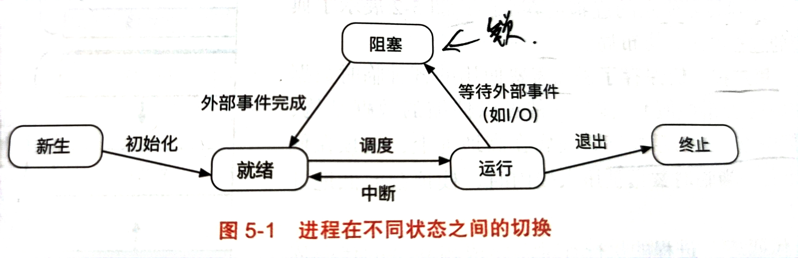
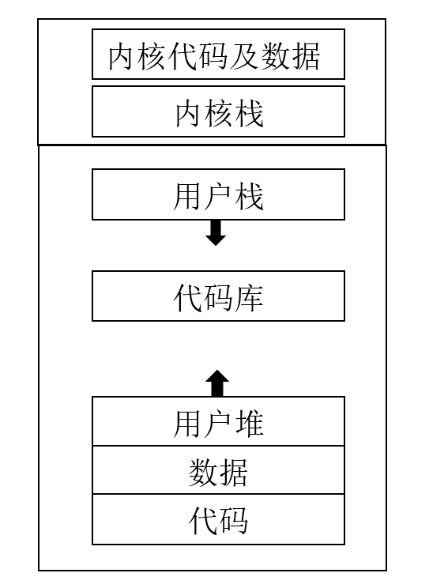
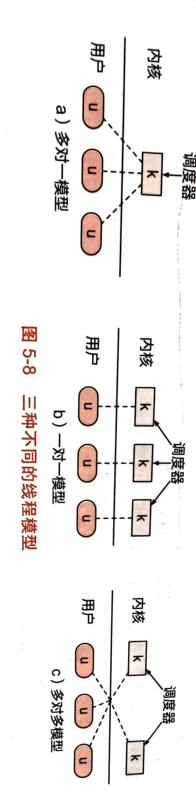

## 进程与线程
- 现代操作系统需要让多个程序同时运行，因此操作系统提出了进程的抽象。每个进程都对应一个运行着的应用程序。进程的抽象让应用程序觉得自己在独占整个CPU，不需要考虑让出CPU给其他程序。进程对应的是CPU资源的虚拟化，将CPU资源分成一个一个时间片，每个时间片内一个进程独占整个CPU。
- 在进程的基础上，操作系统提出了一个叫上下文切换的，通过保存或者恢复程序运行时的状态(上下文，也叫现场)，可以让进程暂停恢复，实现CPU资源的复用。
### 进程
- 进程的状态可以看下面这张图。

- 进程具备独立的虚拟内存空间，进程的内存空间布局可以参考c++程序的内存分布，我感觉一模一样，就是进程地址空间头部是内核空间。其中代码库是依赖共享的动态链接库，进程的代码在地址空间的最底下，内核部分位于进程地址空间的最顶部，在用户态时，内核部分不可见，只有进入内核态时才会使用内核部分的数据。

- 书里面有一个熟悉的vvar与vdso，这两个就是有些只读的内核数据，没有必要进内核，可以将其映射出来，由应用程序来读。vdso就是内核与进程共享数据的区域，vvar是一些系统调用的代码实现。
#### 进程操作
- 在内核中，每一个进程都需要一个数据结构来保存其相关状态，这个叫做**进程控制块**(PCB)，包括进程标识符(PID)，进程状态，虚拟内存状态，打开的文件等。有个很重要的部分就是进程当时运行的现场，当操作系统发生进程切换时，需要保存当前运行的进程现场到进程相应的PCB中，然后读取下一个进程的现场，从而切换程序执行。
```cpp
struct task_struct{
    volatile long state;                //进程状态
    struct mm_struct *mm;               //虚拟内存状态
    pid_t pid;                          //进程标识符
    struct task_struct __rcu *parent;   //进程间关系
    struct list_head children;
    struct files_struct *files;         //打开的文件
}
```
#### 进程的创建：fork
- Linux进程的创建方式是fork，新的进程是从已有的进程中分裂出来。子进程是父进程完全相同的拷贝，父进程与子进程的内存，寄存器，计数器等几乎一模一样，除了他们拥有不同的PID与虚拟内存空间。fork后，父进程返回的是子进程的PID，子进程则返回的是0。从操作系统调度机制来看，父进程和子进程是两个独立的进程，所以谁先谁后没有定论。
- 对于文件描述符，文件描述符是操作系统对于某一文件引用的抽象，每个进程会维护一个fd表存在PCB里，里面有所有的文件描述符，同时内核中也有一个唯一的文件描述符表。fork时也会拷贝一份fd表，同时相应内核中fd表上相应的fd的应用计数加1。
- fork是拷贝父进程的所有东西，但是这样有些只读的数据不需要当前拷贝的，可以引入写时拷贝的技术，这样需要修改的时候再拷贝，可以提高一些效率。
- fork的优点主要是简洁，它的实现相当的简单，fork+exec相当于是进程创建进一步解耦。
- fork的问题在于：fork要将进程全部复制，这样就与进程与内存的管理机制有耦合，不利于维护；而且复制的太多，效率低，即使有写时拷贝，但是建立映射的代价都很大；fork存在安全漏洞，因为它与父进程的数据完全一致。
- fork的进化版本有几个：首先是**posix_spawn**，这个将fork+exec的功能合二为一，但其执行效率比fork高。
- 然后是vfork：这个是一个轻量级的fork，它不会为子进程单独创建地址空间，它与父进程共用。vfork+exec可以减少一次原有的地址空间拷贝，exec后父进程不会受到影响，因为写时拷贝的逻辑。
- 精密的控制用clone，clone可以指定复制的部分，允许子进程与父进程共用一些地址空间，它还允许应用程序指定子进程栈的位置。像posix中线程的创建就是clone实现的。
#### 进程的执行：exec
- fork之后如果想让子进程执行别的任务，就可以用execve来实现：
```cpp
#include<unistd.h>
int execve(const char* pathname,char* const argv[],char* const envp[]);
```
- execve中pathname是新程序的位置，argv是相应输入的参数，envp是相应的环境变量。当exe执行时，会有以下几个步骤：
- 根据pathname指明的路径，将可执行文件数据与代码段映射到当前进程的地址空间中；重新初始化堆栈，重新初始化时会进行地址空间随机化，最后修改PC。
#### 进程管理：
- 对于Linux而言，初始的时候只有一个init进程，其他所有进程都是init进程fork+exec而来，这样所有的进程可以表现成init为根的一颗进程树。内核在进程树的联系基础上提供了监控、回收、信号分发等一系列功能。
- linux中，子进程一定要由父进程来管理的，当子进程执行结束后，必须要父进程将其回收，也就是waitpid函数。如果不wait的话，那么子进程就不会释放资源，此时就是孤儿进程，内核会为其保存PID与终止信息状态，如果万一父进程异常退出，那么此时init进程就会接管它，子进程也就成了守护进程。父进程对子进程的监控是wait，wait有多个变种，比较常用的是waitpid。
```cpp
#include<sys/types.h>
#include<sys/wait.h>
pid_t waitpid(pid_t pid,int *wstatus,int options);
```
- pid是等待的子进程pid，wstatus是子进程的状态，第三个是其他选项一般设为0。
- 为了方便应用程序的进程管理，内核还定义了多个进程组合而成的小集合，进程组与会话。进程组就是父进程与它fork的所有子进程组成一个进程组，进程组id叫做gid。如果子进程想去别的进程组，那么它需要调用setpgid。
- 会话则是进程组的集合，会话一般将进程组分为前台进程组、后台进程组。
### 线程
- 早期来说，进程就是CPU调度的最小单位，但是随着程序与计算机发展，进程这一抽象过于笨重，于是人们引出了线程的概念，**线程相比于进程来说，分离了内核栈与用户栈；共享了其他的区域**，整个多线程地址空间如图：

#### 用户态线程与内核态线程
- 根据线程是在用户态创建还是在内核中创建分为用户态的线程与内核态的线程。对于操作系统而言，他给内核态中创建的线程分配一个TCB(线程控制块)，操作系统也是根据其TCB来调度内核线程的，也就是说从操作系统的角度，它根本不知道你有多少个用户态线程。它只知道你有多少内核态线程。在用户空间的用户线程也有一个自己的TCB，它上面的调度是应用程序来完成的，同时用户态的线程无法从外部切换，他们只能自己让出CPU。可以把**内核线程想象成用户线程的容器**。
- 与内核态的线程相比，用户态线程更加轻量级，创建开销也小，因为不需要进入内核，切换也更快。根据用户态与内核态线程的个数，可以大致划分出三种模型：假设用户态线程数有N个，内核态线程数有M个。

- N=M的情况就是基本的线程模型；N>1 M=1是基本的协程模型；而多对多是现在使用比较多的在多核上实现协程的一种模型。一般来说一个核上一个时间片内只能跑一个内核线程，所以单核的多线程实际上没有提升效率的功能，他只是并发；而这种情况下用切换更快的用户态线程实现并发其消耗的代价与切换速度肯定是比此时的多线程快的。但对于多核而言，由于用户态的线程没法被CPU调度，所以如果用naive的协程模型的话，此时只有一个CPU在工作，浪费了CPU资源，这种情况下应该用多内核线程的方式来工作，内核线程的数量等于多核CPU的数量时，此时效率提升达到最大，此时是真正的并行；而如果线程个数继续增大，线程切换速度的弊端就会体现出来，此时应该在每一个内核线程上调度多个协程来实现更快的切换。
#### 线程的接口
- 线程库为应用提供了创建、退出、合并等多个操作线程的接口，一般使用的是POSIX线程库创建的基本接口。
- **线程创建**：线程创建提供的接口是pthread_create，该接口可以创建一个新的内核线程。这个函数的实现是通过clone，在clone中设置一系列的参数让线程与父进程共享除了栈之外的东西，这样他就成了线程。
```cpp
#include<pthread.h>
int pthread_create(pthread_t* thread,const pthread_t *attr,void* (*start_routine) (void*),void* arg);
```
- **线程退出**:线程退出时pthread_exit，但是这个是不必要的，因为当线程程序运行结束后，它会隐式的调用exit。同时返回值会被设成retval，所以这个无所谓。
```cpp
#include<pthread.h>
void pthread_exit(void* retval);
```
- **线程让出资源**：线程可以主动的暂停，用过pthread_yield，这这个调度机制就挺像协程。
- yield与sleep的区别在于，sleep之后必然是暂停sleep的秒数，而yield有可能下一次就被调度，yield让出后，再次被选择是根据操作系统调度的策略，yield不会影响。
```cpp
#include<pthread.h>
void pthread_yield(void);
```
- **线程等待**：由于多线程很有可能会出现线程之间相互依赖的情况，因此需要让线程可以等待别的线程运行完，也就是pthread_join,它可以等待给定线程号的线程执行完。retval负责保存等待的线程返回的值。
```cpp
#include<pthread.h>
void pthread_join(pthread_t thread,void **retval);
```
### 协程
- 协程就是用户态线程与内核线程是多对一或者多对多的关系。协程相比于线程，其切换的速度快，创建的代价小，所以十分适合高并发的应用。同时协程切换的机制是自己让出去，这样应用程序可以自行决定切换的时间，当需要执行大量IO读写时，此时就可以让出CPU，这样相比于一个时间片一个时间片固定的切换，效率会更高。
- POSIX提供了协程的支持，主要是使用ucontext.h的接口：
```cpp
#include<ucontext.h>
int getcontext(ucontext_t* ucp);
int setcontext(const context_t *ucp);
int swapcontext(ucontext_t* t1,ucontext_t* t2);
void makecontext(ucontext_t *ucp,void(*func)(),int argc,...);
```
- 其中getcontext是用来保存相应协程运行时的现场的，setcontext是用来恢复协程运行的现场，makecontext是用来创建一个全新的协程现场。
```cpp
ucontext.uc_link =NULL;
ucontext.uc_stack.ss_sp=func_stack;
ucontext.uc_stack.ss_size=sizeof(func_stack2);
```
- 注意保存完现场后，如果想用ucontext实现协程，应该修改ucontext的栈空间，与大小，清掉原来的现场，给新的makecontext让路。