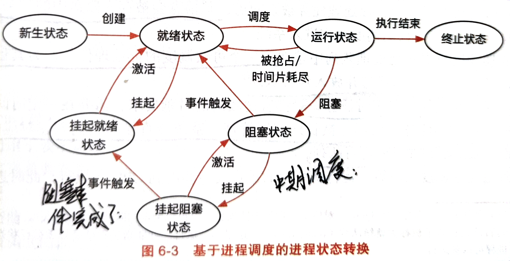
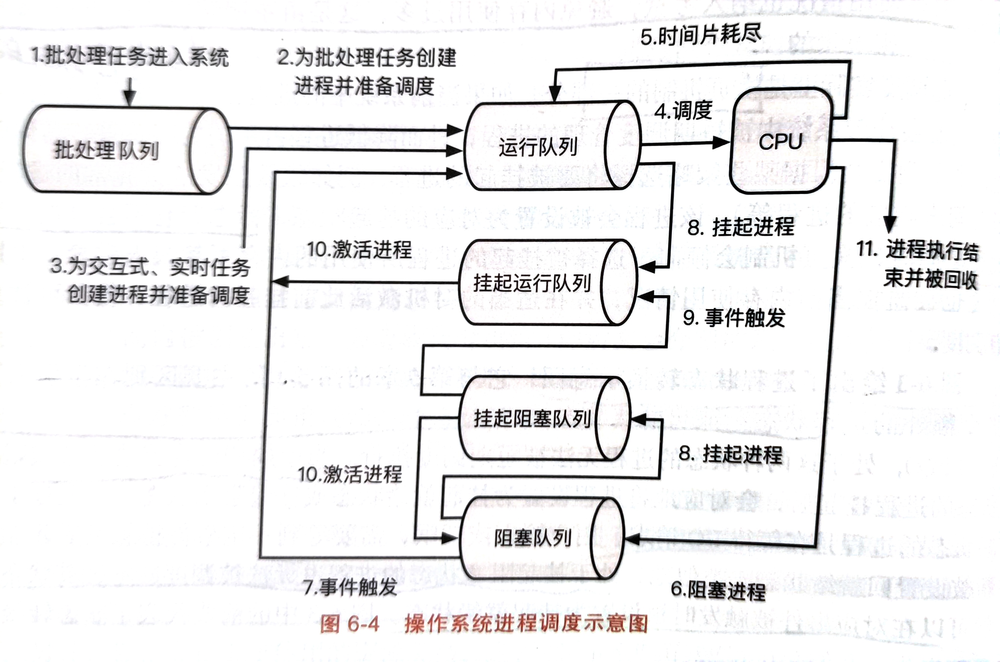

## 操作系统调度
- 操作系统进程调度问题是一个很重要的问题，从操作系统的性能来考虑，调度尽可能需要考虑**周转时间与吞吐量**，也就是当任务被发起到执行完毕退出所需的时间；从用户的体验感，也就是对于交互式任务来考虑，调度主要考虑**响应时间**，也就是当任务从被发起到第一次向用户提供输出所需的时间。从公平性来考虑，应该是每个用户所占的CPU资源都相同。
- 操作系统调度器实际调度的是**内核线程**，而不是进程，进程是资源隔离的单位。在Linux中常用任务来描述线程，所以实际上平常说的调度任务实际就是调度线程。一般来说调度器会维护一个叫**运行队列**的方式来管理任务。调度器的主要作用是做出调度决策，一般来说调度器的设计要考虑两个部分，其二是调度器应该做什么样的调度决策，调度器应该如何做出符合预期的调度决策。
- 调度器主要需要考虑的性能指标是吞吐量，周转时间；对于交互式程序考虑用户使用体验则需要考虑响应时间；还需要考虑一些非性能指标，公平性，资源利用率以及实时性，能耗等。
- 调度器还需要考虑一些权衡：如调度的开销与调度效果；优先级与公平性；性能与能耗。
### 单核调度机制
这部分主要考虑单核的调度机制：
- 调度机制可以分为长期，中期，短期调度。
- 长期调度主要考虑的是限制运行队列中的任务数量，避免短期调度的开销过大，长期调度会根据当前系统中的CPU以及I/O利用率的情况来选择合适的I/O密集和CPU密集型的任务；短期调度主要负责实际调度任务，让进程在就绪状态、运行状态以及阻塞状态来切换，短期调度的设计应该尽可能考虑系统调度的指标。
- 长期调度与短期调度主要考虑CPU与IO资源，但是没有考虑内存资源，内存资源主要是中期调度来负责的，中期调度是分页机制的一部分，当当前系统中可用内存不足时，中期调度会挂起某些被短期调度管理的线程，将它们的物理页换出到硬盘上去，让出更多的空闲内存。
- 一般长期调度的触发间隔比较长，它负责控制处理队列中任务的数量；中期调度则是负责内存管理，短期调度则负责实际的任务调度。如下图则是进程的调度机制：

- 当任务被发起时，它会被放入磁盘中的批处理队列，由长期调度从中选出一些任务放入运行队列中被调度；运行队列中的任务则是由短期调度负责；当操作系统可用物理内存不够时，中期调度会将一些不用的任务挂起，空出一些内存出来，当内存足够时又会重新激活挂起的线程，并将其列入就绪状态；当IO阻塞时，任务将进入阻塞状态，短期调度此时不会调度它，需要等到事件触发阻塞结束时才能继续被调度。

### 单核调度策略：
- 调度器主要考虑两个问题，需要调度哪个任务；每个任务执行多长时间。对于现代操作系统来说，需要着重考虑的一点是如何调度让每个任务从用户的眼中是在同时进行的。之后才会考虑如何调度让性能最佳。
#### 时间片轮转（RR）
- 用户体验最直接的指标就是响应时间，现代的操作系统调度一般都是采用**时间片轮转**的思路，也就是将CPU划分为一个一个时间片，每个任务独占CPU的一个时间片，如果时间片设置的足够小，那么每个任务都会在一定的时间内执行并响应用户；对于RR策略来说，**时间片大小的选取**是需要考虑的问题，时间片选的越小，那么任务响应的时间就越快，但是这意味着调度的次数会增加，调度的开销就大。
- 这个策略的弊端是**任务的平均周转时间比较高**，因为所有任务是平分CPU资源的，从这个角度来说**RR策略保证了任务的公平性**，但是公平必然会损失性能。
### 优先级调度：
- 优先级调度是在RR的时间片轮转基础上，满足用户的响应时间指标后考虑系统性能的。首先为了给用户提供更好的体验，交互式任务的优先级一定高于批处理任务。然后对于有明确截止时间的任务，应该设置最高的优先级。因此优先级的顺序从高到低应该是：**明确截止时间的任务，交互式任务，IO密集型任务，批处理任务**。
- 优先级思想最早体现在早期的批处理任务的策略：主要有三个：先到先得（FCFS)，最短任务优先(SJF)，最短完成时间优先(STCF)，这三个策略都是考虑批处理任务，主要考虑的是平均周转时间而不考虑任务响应时间。
#### 先到先得(FCFS)
- 先到先得策略就是谁先来就调度谁，就是个先来后到的策略。它考虑的优先级是：**任务到达时间早的优先级高**。这个策略最大的特点就是**简单直观**，开发者只用维护一个队列即可。这个策略属于**非抢占式调度**，在任务执行完前是不会让出CPU的。
- 这个策略的问题在于**对短任务不友好**，假设前面排着一个长任务，那么这个短任务要等很久，本来它只用很短的时间就执行完了，但现在它的周转时间会变得很长；同样**对IO密集型也不友好**，当IO密集型需要读写IO而进入阻塞让出CPU时，假设后序是一个长时间运行的任务，那么当IO读写完了也需要等待很长时间；而且它根本就没有考虑响应时间，**对交互式任务很不友好**。
#### 最短任务优先（SJF）
- 这个策略是最短的任务先执行，也就是考虑**执行时间最短的任务优先级高**；它的任务平均周转时间肯定要比FCFS要短，但是它也存在一些问题，首先**它必须预知任务运行的时间**，这个就很难办；其次它的表现**严重依赖于任务到达时间点**，如果一个运行时间比前一个短的稍微来晚点，也得等前一个运行完了才能继续，所以并没有真正的最短任务优先，是在FCFS的基础上的最短任务优先。与FCFS一样，都是**非抢占式调度**。
#### 最短完成时间优先（STCF）
- 之前的最短任务优先并不是真正的最短任务优先，迟到了的任务是无法受益的，因此可以按照最短完成时间来调度，也就是**任务剩余时间短的优先级高**；谁完成时间最短，谁就直接把前面的CPU抢占了；这个策略不同于之前的必须执行完才是下一个，属于**抢占式调度**，这个策略较好的考虑的短任务，**它的平均周转时间是比较小的**，但是这个策略的问题在于**长任务的饥饿问题**，也就是说如果短任务多了，那么长任务需要一直等待。
#### 多级队列（MLQ）
- 之前的早期批处理任务调度策略都是隐式的优先级，并没有直接指出优先级，多级队列是明确的指出的优先级，每个任务的优先级设定好了就不会变动，它属于静态的优先级调度策略。
- 多级队列就是说每个不同的优先级设置一个队列，优先处理高优先级的任务，相同优先级之间采用时间片轮转的策略保证响应时间。MLQ适合于静态的应用场景，这类场景下任务信息可以再执行前获得，基于此可以分配不同的优先级来实现调度。
- MLQ是一种高效的优先级调度策略，但是从另一个角度说，它依然没有解决**低优先级的饥饿问题**。如果高优先级的任务数量很多，那么低优先级永远也不会去执行。
- 同时优先级固定也会带来一个叫做**优先级反转**的问题，比如有任务A,B,C，优先级依次从高到低，然后此时C恰好持有一把锁，A也想获得这把锁，但是因为C先拿走了，所以A此时只能进入阻塞状态等C放锁；然后因为B比C优先级高，所以B先运行，那么此时就有B比A优先级高的一个假象。一般来说解决这类问题的思路是**优先级继承**，也就是A暂时把它的优先级转移给C，让C先完成，这样A就能接着完成。
#### 多级反馈队列（MLFQ）
- 多级队列是一种较好的考虑优先级的策略，但是**它没有解决低优先级的饥饿问题**，而且多级队列需要提前预判各个任务的优先级，但随着任务不断复杂，**预测任务变得比较困难**。因此静态的策略已经不能满足需要，需要动态的调整优先级，这也就是多级反馈队列。多级反馈队列的最大特点是实现了**优先级的动态设置**。
- 具体的策略是，**短任务具有更高的优先级**，这样主要是为了降低平均周转时间；IO密集型的任务因为其CPU运行时间比较短，所以它的优先级一般也比较高，有利于提高IO资源的利用率；交互式任务一般是短任务，所以其优先级一般也比较高。
- 在真实系统中，可能无法去预测是短任务还是长任务，因此需要动态的去调整，当任务第一次进入运行队列时，系统会假定该任务是最高优先级，如果该任务运行时间超过**最大运行时间**，那么系统自动会给其降低优先级。
- 为了缓解低优先级的饥饿问题，调度器会定时的将所有低优先级的队列重新提到最高。保证低优先级有机会执行。
### 公平共享调度
- 前面都是从调度器的性能以及用户体验的角度来考虑的，现在从用户的公平性角度考虑，如果用户的优先级都相同，那么此时每个人的CPU资源应该相同，跟每个用户的任务数量无关。可以用**份额来量化CPU资源**，份额代表着CPU时间占比。每个用户获得相应份额的CPU资源，然后再自行分配给自己手下的任务。
- 公平共享调度有两个经典的调度策略，彩票调度与步幅调度。
#### 彩票调度
- 彩票对应于每个用户的份额，用户的份额越高，该用户被抽中的概率越大。彩票调度会先计算出一个随机数，然后看这个随机数落在哪个用户的区间里，落在哪那个用户就占有当前的CPU时间片。一般来说，**份额都是从大到小来排列**，因为这样可以减少决策的查询次数。
- 彩票调度存在一些优化的手段，首先是**彩票转让**：这个优化是为了解决优先级反转的问题，当高优先级遇到低优先级持有锁时，高优先级会暂时将它的份额转让给低优先级，让低优先级赶紧完成然后让出锁。
- **彩票货币**：这个优化是说当每个用户获得这一刻CPU时间片时，如何进一步分配给自己负责的任务。每个用户也可以自行分配货币来决定谁先工作。彩票货币在彩票的外面添加了一层抽象，一旦用户发生彩票转让彩票份额发生了变化，也不影响内部任务的分配。
- **彩票膨胀**：彩票膨胀是说给任务一定自由度，他可以自行决定当前所需的份额是多一点还是少一点，但是这种优化的前提是假设每个任务都是互相信任的，不至于一个任务即使不需要这么多CPU资源但还在疯狂占用。
- 彩票可以带来一定的公平性，但问题在于随机数上；因为数是随机的，所以在调度次数比较少的情况下不一定会按照预想的个数来分配，不一定能保证公平。只有在调度次数比较多的情况下，才能达成相应的公平性。
#### 步幅调度：
- 步幅调度是说，在真实的运行时间上引进一层抽象，叫做虚拟时间。CPU调度是按照虚拟时间来进行调度的，每个任务根据份额的不同，运行相同时间所增加的虚拟时间是不同的。这样虽然调度器感觉它对每一个任务都是公平调度，但实际上每个任务运行的时间是根据其份额决定的，这样就达到了按照份额来分配CPU的效果。