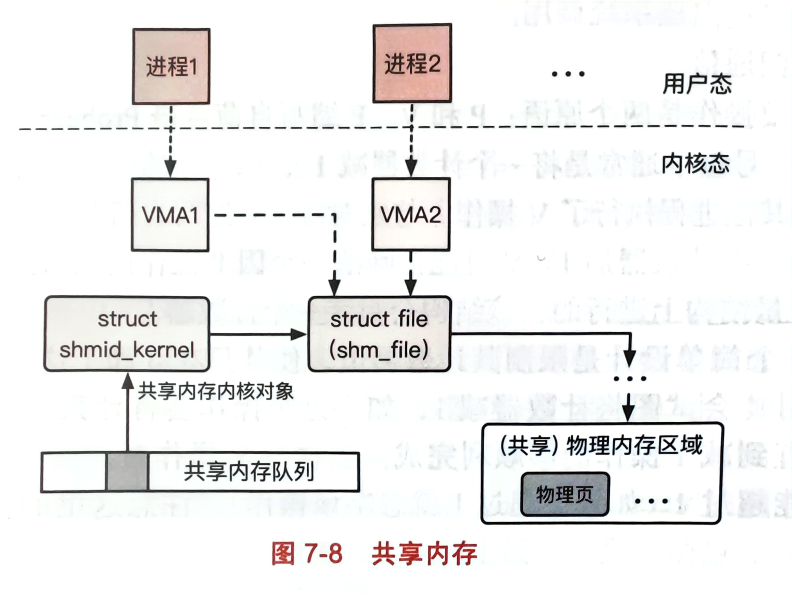

## 进程间通信（IPC)
- 进程间通信是为了辅助多进程协作的而存在的，多进程的主要好处是提供了模块间的隔离，增强了安全性，提高了应用的容错能力。
### 进程间通信基础
#### 基于共享内存的消息传递
- 一个IPC通信至少需要一个发送者一个接收者，也称为client与server，因此其实基本的IPC实际上是CS模型。一般来说两个进程之间的数据是隔离开的，为了让相互隔离的进程可以互相通信，需要采用**共享内存**的机制，也就是两个进程的一段虚拟内存被映射到同一块物理内存下实现共享。有了共享内存，相当于两个隔离的进程之间存在着可交流的中间缓冲区，可以通过这个缓冲区进行通信。
- 光有共享内存这个载体不够，为了方便应用操作，应该对其做一些抽象：
- 首先是对通信数据的抽象，一般通信数据会被抽象成**消息**，消息一般包含一个头部(header)与一个数据段(payload);头部往往包含消息长度，校验码，目的地址等消息，数据段则是纯粹的数据。
- 接着是对数据传递过程进行抽象，进程间通信的一个主要功能是在进程间传递数据，因为之前把数据抽象成了消息，进程间通信就可以抽象成**消息传递**，并定义一系列接口：发送信息：send；接收信息：recv；远程过程调用：rpc；回复远程信息：reply。远程过程调用需要回应是因为传输距离比较长，出现错误的概率大，所以需要应答确认来保证发送到了。
- 基于共享内存的消息传递特点是：**操作系统不干预数据传输**，在操作系统看来只是两个进程往各自的虚拟地址上读写数据。也可以不用消息的抽象，直接在共享内存上读写数据，不过这样容易出BUG，首先你无法同步两个进程的指针，写起来就很困难，其次这么整其实破坏了进程的隔离性，所以其实不建议不加抽象直接搞。
#### 基于操作系统辅助的消息传递
- 除了直接在用户空间共享内存之外，还可以通过操作系统提供的一些接口辅助信息传递，如send与recv等；一般操作系统辅助是在内核里开辟了一块缓冲区，发端先copy到内核里，然后再从内核copy到收端。
- 共享内存与操作系统辅助传递两个对比来看，**共享内存的速度会快一些**，因为它不需要将数据先拷贝到内核，理论上直接映射是可以直接零拷贝的；然后操作系统辅助的话**它的接口抽象会更简单**，并且由于不用破坏收发双方进程的隔离性，所以**更安全**。
#### 同步和异步
- 同步IPC和异步IPC的区别是在于两个用户在传输数据时使用一个执行流，还是两个用户分别有各自的执行流。比如同步的情况，当client发完后会阻塞，此时执行流移动到server上，等server接收完毕后再转移给client。异步的话，client发完不会阻塞，一般异步会通过信号的形式通知。
- 同步的优点是逻辑清晰，且不需要消耗太多内核资源，而异步需要内核来通知并调用回调函数，内核开销比较大。同步的问题是需要阻塞，当高并发的场景下，阻塞就会增加客户的响应时间，甚至无法满足服务。
#### 超时机制
- 进程的隔离会带来另一个问题，通信双方很难确定对方的状态，如果server一直不回应，client需要一直为接收者预留功能来接收回应，尤其是同步的IPC，他需要一直阻塞会导致整个进程卡死。因此需要引入超时的机制，等待一定的时间然后就自动退出，避免类似于拒绝服务的攻击。
#### 权限检查
- 进程间的通信需要检查是否有通信的权限来保证安全性，在Linux中，进程的权限与其有效用户的权限相同，跟举起有效用户的权限来检查是否有权限进行通信。
- 权限分发一般是通过一个用户态的服务，叫**命名服务**，服务端首先将自己提供的服务告诉命名服务进程，然后由client会在命名服务中查询当前的服务，并尝试获取权限。
- 命名服务在用户态的原因是命名服务提供权限的策略对于不同的进程来说是不同的，操作系统不太好全部规范化，因此就将其交给用户态来实现。
- 权限分发还可以通过fork来继承权限。
### 宏内核进程间通信
- 一般进程间经典的通信方式有6种：管道，消息队列，信号量，共享内存，信号以及套接字。一般进程间通信都是**SystemV**提供的API。
#### 管道
- 管道是一种单向的IPC，内核中存在一定缓冲区，并且传输的数据是字节流。管道在UNIX中是被当做一个文件，系统调用会提供两个文件描述符供用户读写文件。
- 如果管道的写端没有被进程持有，而收端尝试去读的话，此时会受到EOF，如果写端有进程持有的话，读端就会阻塞在read上。

- 管道分为**命名管道与匿名管道**，匿名管道没有名字，是通过系统调用pipe()创建的,只返回两个文件描述符，注意是pipe[1]写给pipe[0]。因为匿名管道没有名字，所以一般匿名管道只能用于两个关系比较近的进程，比如fork出来的父子进程。
- 当两个关系比较远的时候，此时就应该使用命名管道，创建该管道的命令为mkfifo，需要指定一个全局的文件名与权限，之后读写管道就是在读写这个文件。
- 管道只能单项传输数据，如果想双向传输，那么就用socketpair。socketpair会创建两个socket，父进程关闭一个，子进程关掉另一个。这样双方各拿一个socket通信。
#### 消息队列
- 消息队列，是唯一一个以消息为数据抽象的通信方式，消息队列在内核中的数据结构是一个单链表构成的队列，最初会有个消息头部指针，保存着消息队首与相应的权限；每个消息都会有下一个消息的指针，以及消息本身的内容。
- 消息队列的内存空间有限，一般来说传递长消息时采用共享内存的方式，而非消息队列。通过消息队列传递数据需要先copy到内核，然后再到收端，所以有个代价。
#### 信号量
- 信号量是用来辅助控制多个访问线程访问有限数量资源的。
- 信号量不同于消息队列这种明确是传递消息的，它主要是用来同步，它就能传递一个整数，一般还是0，1。信号量操作主要有两个原语，**P操作与V操作**，P操作就是信号量减1，如果失败就会阻塞，直到可以减；V操作就是信号量+1，V操作可以唤醒一个因P操作阻塞的进程。
#### 共享内存
- 共享内存是这6个IPC中基于共享内存辅助的消息传递方式，其他的都是基于操作系统辅助的，也就是当操作系统给共享内存映射完相同的物理内存后，操作系统就不再参与通信。
- 使用共享内存很重要的一个原因是共享内存不需要先拷贝到内核空间中，**速度比较快**，共享内存的核心思路就是允许一个或者多个进程所在的虚拟地址空间中映射相同的物理页，从而进行通信。
- 共享内存的实现机制：首先内核会给全局的共享内存维护一个全局的队列结构，这个队列的每一项是一个shmid_kernel结构体与一个IPC key来绑定的，各进程可以通过key来找到并使用同一段共享内存；该进程能否操作这段共享内存时SystemV的权限检查机制来判断；
- 当两个进程同时对一个共享内存建立了映射后，内核会给他们分配两个VMA结构体，进程可以通过他们各自的虚拟地址来访问VMA并访问其背后的共享内存空间。

#### 信号
- 管道、消息队列、共享内存主要是关注数据传输设计，而信号的作用是**单项的事件通知**能力。一个进程会为一些特定的信号注册回调函数，当进程收到对应的信号后，内核会自动调用该信号的回调函数。
- 信号的发送者可以是其他用户态的进程，但更多的是内核发送通知，用户态一般是使用操作系统提供的API来通知其他进程，如kill等；信号的阻塞提供一个专门的系统调用sigpromask来设置相应的信号掩码。
- 信号需要用sigaction来注册信号，注册的格式是一个sigaction的结构体，结构体包含相应的信号掩码以及回调函数。
- 信号需要考虑其可重入性，比如一个进程收到了一个信号后回调函数由于中断等原因下陷到内核时，又收到了一个相同的信号，这时候可能会重新调用一次该回调函数，因此这种情况下必须保证其可重入性。可重入一般要注意，不使用静态数据，或者静态数据只读；尽量使用本地数据，在使用全局数据时记得加锁；不调用不可重入的函数。