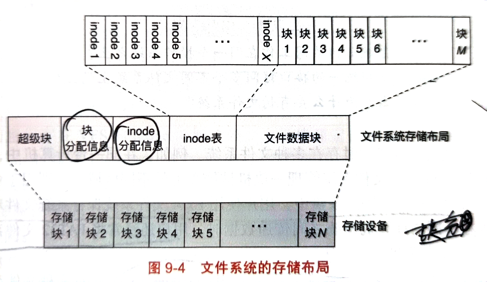

##第9章 文件系统
- 文件是操作系统进行存储时使用最多的抽象之一，每个文件实际上是一个**有名字的字符序列**，也可以把文件叫做虚拟磁盘，我们实际操作时都是在操作文件而非直接操作硬盘中的数据。序列内容为**文件数据**，而序列长度，修改时间等描述文件数据的属性特征的其他信息被称为**文件元数据**。
- 文件系统就是管理文件数据与文件元数据的系统，即文件系统。文件系统提供文件抽象并实现文件访问所需要的接口。考虑到存储空间太大，文件以数据块为单位进行访问，一个块一般4KB。
- 当应用程序想访问或写入一些数据到存储设备上时，它会采用Linux系统提供的open，write，read等系统调用；在处理系统调用时，内核会调用**虚拟文件系统**（VFS）来处理文件请求，虚拟文件系统负责管理具体的文件系统如inode文件系统，FAT32文件系统等。
### 文件名与目录
- 文件与inode是一一对应的，但是通过inode号来记录文件名不好记忆，而且直接用inode号会与文件存储的位置强耦合，这样不安全。
- 因此每个文件是有一个文件名的，然后为了方便访问，将文件名存放在相应的目录中。目录也是一种特殊的文件，它记录了inode号到文件名的映射。目录是一个树形的结构，每个叶节点都挂载一个目录项。一个目录项内有文件名，对应的inode号，文件名长度等信息。在POSIX中，目录中会有两个特殊的目录项，"."与".."，"."表示当前目录，".."表示上一级目录。
- 对目录的操作主要是查找，遍历，添加，删除这4个操作，比如mkdir，rmdir等。
### 硬链接与符号连接
#### 硬链接
- 硬链接与符号连接就是目录项与文件关联的方式。
- 硬链接就是一个文件名或者一个目录项直接指向一个文件。因为文件名并不是文件的元数据，所以多个文件名可以指向一个文件，也就是说一个inode可以被多个目录项所指向。这样的好处是允许一个文件被多个目录项引用，避免重复拷贝。
#### 符号链接
- 符号链接又叫做软链接，它不是直接指向一个文件，它也是一个文件，里面存储了一个文件路径，当引用这个文件时，会去寻找另一个目标文件。就有点像快捷方式。
- 由于符号链接可以随意的创建相应的连接，所以会带来路径解析时的复杂性，符号链接多次连符号连接就要进行多次的路径解析，或者符号链接连成环了就根本解析不了。
- 绝对路径以/开头，相对路径不以/开头
### inode文件系统
- inode文件系统是UNIX提出的一种文件系统，他主要是提升了随机访问的能力；一个文件一般是一个或多个块组成的，为了管理这些块，文件系统提出了一个叫inode的结构来存储一个文件上的块。一个文件对应一个inode，可以说inode在文件系统中的作用就跟内存管理中的页表一样。为了避免浪费，inode采用分级的方式来组织存储块号。inode中有一个**基本元数据**用来存储文件模式，链接数，文件大小与访问时间等；然后下面是几种**存储指针**，第一种指针直接指向数据块，第二种指针指向一级索引块，第三种指针指向二级索引块。

#### 存储布局
- 文件系统的布局主要需要满足两个方面，首先需要支持链接，也就是每个文件对象单独存储；然后是大文件可以随机访问，不能是链表的形式存储。
- 在UNIX系统中，文件系统的布局是这样的：
- 
- 首先是一个**超级块**，这个超级块用来记录整个文件系统的全局元数据，包括管理空间大小，最后一次挂载时间和一些统计信息等。
- 超级块后面是**块分配信息与inode分配信息**，采用位图的方式，每个比特位对应一个块或者一个inode。
- 再后面是**inode表**，里面保存着整个文件系统的所有inode结构，inode表剩下的是文件数据块的存储区域，保存每个块。
- UNIX的inode文件系统其随机读写性能很好O(1),并且支持链接，减少空间浪费；但其可靠性不太好，一旦inode表g了，那么文件也就无法访问了。